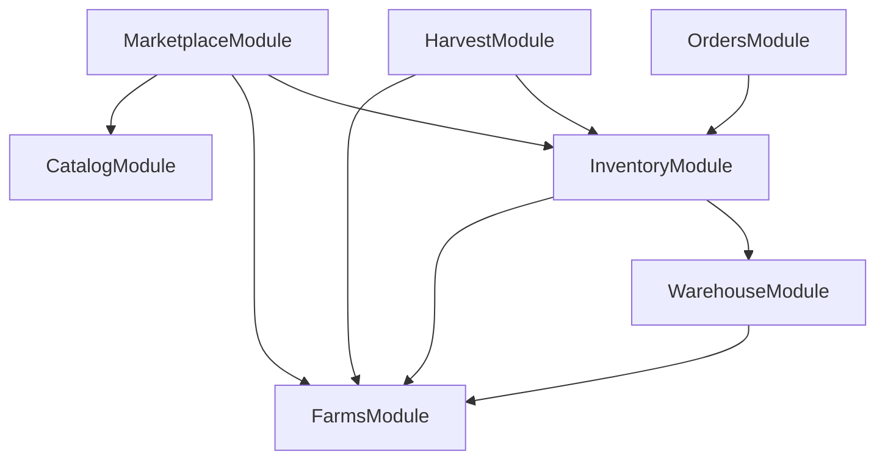
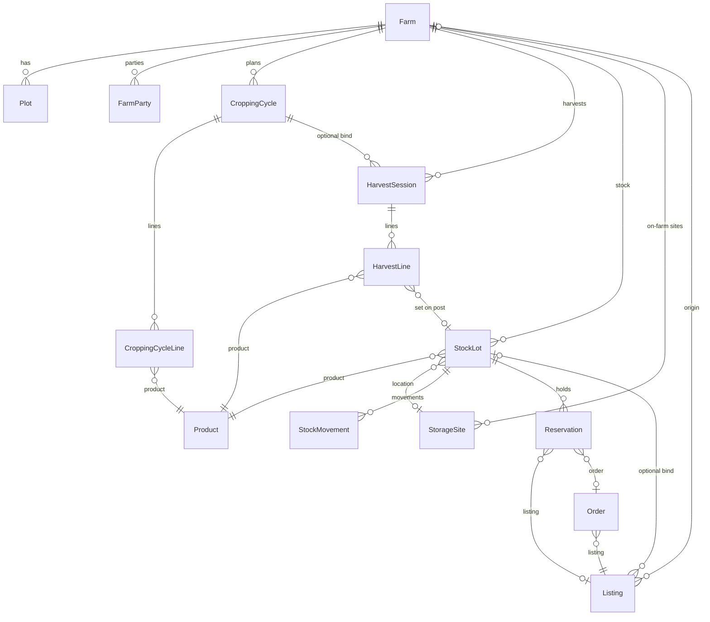
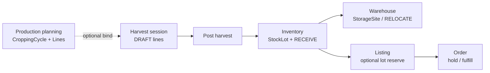

# Nahu Farm V1 — Architecture Overview

**Status:** Reference architecture (as implemented on staging)  
**Date:** 2026-07-16  
**Version:** 1.0  
**Scope:** Phases **4.1–4.7** of the Farmer Platform program (closed on staging)  
**Production:** Nest production URL and Farmer EAS `production` profile remain **unchanged** until explicit cutover approval  
**Audience:** Engineering, product, and new collaborators onboarding to Nahu Farm

This document does **not** authorize new functionality. It consolidates what shipped for Nahu Farm Version 1 and points to the design and API sources of truth.

---

## 1. Purpose

**Nahu Farm** is the farmer operations backbone on the Nahu Platform: register and operate farms, plan production, record harvest, manage stock and on-farm storage, then optionally bind lots to marketplace listings and fulfill orders.

It sits alongside (and does not replace):

| Layer | Role in V1 |
|-------|------------|
| **Catalog** | Product / unit / variety hub (`catalog.products`) — farms do **not** own SKUs |
| **Marketplace** | Listings (coffee-first, product-aware) |
| **Orders** | Buy / sell commerce, escrow-oriented order states |
| **Identity** | Users, roles (`FARMER` / `BUYER`), OTP JWT auth |

**Authority when this overview conflicts with detail docs:**

1. Entity / Identity specs under `docs/03-domain-model/`  
2. [API README](../../apps/api/README.md) — routes and request shapes  
3. [Engineering Playbook](../engineering-playbook.md)  
4. Closed phase designs under `docs/07-decisions/`  
5. [Data dictionary](../../database/docs/data-dictionary.md)

---

## 2. Overall module architecture

### 2.1 Logical domains (PostgreSQL schemas)

| Schema | V1 responsibility |
|--------|-------------------|
| `farms` | Farms, parties, plots (+ hierarchy stubs), seasons, cropping cycles, harvest sessions |
| `inventory` | Stock lots, movements, reservations (stock system of record) |
| `warehouse` | Storage sites (ON_FARM first); zones stubbed |
| `catalog` | Products, units, varieties (shared hub) |
| `marketplace` | Farmer profiles, cooperatives, listings |
| `orders` | Orders, certificates |
| `identity` | Users, roles, auth |

### 2.2 NestJS modules (`apps/api`)

| Nest module | Controllers / services | Phase |
|-------------|------------------------|-------|
| **FarmsModule** | Farms, plots, cropping cycles, **DashboardService** | 4.1, 4.5, 4.6 |
| **HarvestModule** | Harvest sessions / lines (separate module to avoid Farms↔Inventory cycles) | 4.7 |
| **InventoryModule** | Lots, movements, balances, reservations | 4.2, 4.4 |
| **WarehouseModule** | Storage sites | 4.3 |
| **MarketplaceModule** | Farmers, listings (uses catalog + farms + inventory) | 2 + 4.4 |
| **OrdersModule** | Orders (uses inventory holds) | 2 + 4.4 |
| **CatalogModule** | Categories, products | 3 |

**Dependency direction (no circular imports):**



**Invariants:**

- **Inventory is the system of record for stock.** Harvest DRAFT does not create lots; **Post** calls Inventory `RECEIVE` only.  
- **Farms do not own products.** Plans, harvest lines, lots, and listings all reference `catalog.products`.  
- **Farm access** is scoped by farm parties (`FarmsService.assertFarmAccess`).  
- **Dashboard** is read-only aggregation inside FarmsModule (`GET /farms/dashboard`), not a separate store.

---

## 3. Entity relationships

### 3.1 Core ER (conceptual)



### 3.2 Entity summary

| Entity | Schema | Notable status / notes |
|--------|--------|------------------------|
| **Farm** | farms | DRAFT / ACTIVE / INACTIVE / SUSPENDED / ARCHIVED |
| **FarmParty** | farms | OWNER, CO_OWNER, OPERATOR, … |
| **Plot** | farms | Child of farm; Field / ProductionUnit tables exist (API/mobile deferred) |
| **SeasonCode** | farms | Configurable codes (not hard-coded BELG/MEHER only) |
| **CroppingCycle** | farms | DRAFT → PLANNED → IN_PROGRESS → HARVESTED → COMPLETED (+ CANCELLED / ARCHIVED) |
| **CroppingCycleLine** | farms | Planned qty per product; unique per cycle+product |
| **HarvestSession** | farms | **DRAFT** \| **POSTED**; optional plot / cycle; optional `crewCount` |
| **HarvestLine** | farms | Qty + optional grade/moisture/notes; `stockLotId` after post |
| **StockLot** | inventory | RECEIVED → AVAILABLE → …; optional cycle / site / farm |
| **StockMovement** | inventory | RECEIVE, ADJUST_*, LOSS, RELOCATE, RESERVE, … |
| **Reservation** | inventory | Links lot ↔ listing ↔ order holds |
| **StorageSite** | warehouse | ON_FARM (V1 farmer API); COOPERATIVE / NAHU / THIRD_PARTY types exist |
| **Listing** | marketplace | Optional `stockLotId` / `farmId` (4.4 Option B) |
| **Order** | orders | Marketplace lifecycle including escrow-oriented states |

Full columns: [data dictionary](../../database/docs/data-dictionary.md) and Prisma `apps/api/prisma/schema.prisma`.

### 3.3 Traceability chain (V1 happy path)

```
Farm → Plot (optional)
     → CroppingCycle → CroppingCycleLine (planned qty)
     → HarvestSession → HarvestLine
     → (Post) StockLot + StockMovement(RECEIVE)
     → (optional) StorageSite / RELOCATE
     → (optional) Listing + Reservation
     → Order (hold transfer / release on cancel)
```

---

## 4. API boundaries

Global prefix: **`/api/v1`**. Mobile success responses are direct resources; errors: `{ "error": "message" }`.

| Boundary | Prefixes (representative) | Role |
|----------|---------------------------|------|
| **Farms / plots** | `/farms/mine`, `/farms`, `/farms/:id`, `/farms/:farmId/plots`, `/plots/:id` | FARMER |
| **Dashboard** | `/farms/dashboard` | FARMER (read aggregation) |
| **Production planning** | `/season-codes`, `/farms/:farmId/cropping-cycles`, `/cropping-cycles/:id/*`, `/cropping-cycle-lines/:lineId` | FARMER |
| **Harvest** | `/farms/:farmId/harvest-sessions`, `/harvest-sessions/:id`, `/harvest-sessions/:id/post`, `/harvest-lines/:lineId` | FARMER |
| **Inventory** | `/inventory/lots`, `/inventory/balances`, `/inventory/receive`, `/inventory/movements`, `/inventory/reservations` | FARMER |
| **Warehouse** | `/warehouse/sites`, `/warehouse/sites/on-farm`, `/warehouse/sites/:id` | FARMER |
| **Listings** | `/listings`, `/listings/mine`, `/listings/:id` | Public read; FARMER write |
| **Orders** | `/orders`, `/orders/my`, `/orders/:id/*` | BUYER create; JWT / role for actions |
| **Catalog** | `/categories`, `/products` | Shared |

**Harvest post boundary:** `POST /harvest-sessions/:id/post` → internal `InventoryService.receive(...)` → `harvest_lines.stock_lot_id` set. No alternate path that invents stock outside inventory.

Route detail remains authoritative in [apps/api/README.md](../../apps/api/README.md).

---

## 5. Mobile screen hierarchy (Farmer Expo)

Repository: `nahu-buna-gebaya` / `nahu-buna-farmer`.

### 5.1 Tabs

| Tab | Purpose |
|-----|---------|
| Home | Ops dashboard cards + listings hub |
| New | Create listing |
| Orders | Marketplace orders |
| Earnings | Financial / escrow UI (not duplicated on Home) |
| Advisory | Advisory content |
| Settings | Entry to Nahu Farm ops screens |

### 5.2 Stack hierarchy (Nahu Farm V1)

```
Tabs
├── Home ──► dashboard cards → Farms | Inventory | CroppingCycles | Orders
├── NewListing / Orders / Earnings / Advisory
└── Settings
      ├── Farms → FarmForm → FarmDetail
      │              ├── PlotForm
      │              ├── CroppingCycles → Form → Detail → HarvestSessionForm
      │              └── HarvestSessions → Form → Detail
      ├── Inventory → ReceiveStock | LotDetail → StorageSites
      ├── StorageSites → StorageSiteForm
      ├── CroppingCycles
      └── HarvestSessions

Also: EditListing, Profile (stack); ProfileSetup gate on Home when profile missing
```

**Mapping track labels:** M3 Farms · M4 Inventory · M7 Warehouse · M8 Sell-from-stock · M10 Plans · M11 Dashboard · M12 Harvest — all **Done** against Nest staging. See [Backend ↔ Mobile feature mapping](../backend-mobile-feature-mapping.md).

### 5.3 API targets (config)

| Build | API |
|-------|-----|
| Local default / EAS `preview` & `apk` | Nest **staging** |
| EAS `production` | Legacy Express (held until Nest cutover) |

---

## 6. End-to-end data flow



| Stage | What happens | Stock impact |
|-------|--------------|--------------|
| **1. Plan** | Farmer creates cropping cycle + planned product lines; advances lifecycle manually | None |
| **2. Harvest (DRAFT)** | Record session date/qty/quality context; may link cycle | None |
| **3. Post** | Session → POSTED; each line RECEIVE into inventory | Lots + movements created |
| **4. Warehouse** | Assign / relocate lot to ON_FARM (or other typed) site | RELOCATE movements |
| **5. Listing** | Optional sell-from-stock: listing + reservation on lot | Qty held / reserved |
| **6. Order** | Buyer order; hold can transfer listing → order; cancel restores | Reservation / movement rules |

**Manual plan lifecycle:** Harvest post does **not** auto-mark a cropping cycle HARVESTED; farmer uses cycle actions explicitly.

**Corrections after post:** Adjust stock via inventory ADJUST / LOSS — harvest sessions are not deleted once POSTED.

**Dashboard:** Home reads aggregates from the above domains (`farm`, `inventory`, `marketplace`+`orders`, `production`, `alerts`). Escrow/settlement totals stay on Earnings.

---

## 7. Roadmap status (V1)

### 7.1 Phase 4 sub-phases

| Sub-phase | Name | Status |
|-----------|------|--------|
| **4.1** | Farm management | Closed on staging + Farmer UI |
| **4.2** | Inventory | Closed on staging + Farmer APK |
| **4.3** | Warehouse | Closed on staging + Farmer M7 |
| **4.4** | Listing ↔ stock | Staging smoked + Farmer M8 (production held) |
| **4.5** | Production planning | Closed + Farmer M10 |
| **4.6** | Dashboards | Closed + Farmer M11 |
| **4.7** | Harvest management | Closed + Farmer M12 |

**Milestones (git tags):** `milestone-phase-4.2` … `milestone-phase-4.7` (platform) and mobile tags through `milestone-phase-4.7-mobile`.

Design sources: `docs/07-decisions/phase-4*.md`. On-device checklists: `docs/08-guides/phase-4.*-on-device-smoke.md`.

### 7.2 Explicitly held

- Nest **production** cutover and Farmer EAS **production** Nest URL  
- Live payment provider webhooks / production SMS OTP (marketplace ops)  
- Broader **Amharic UI cleanup** (separate follow-up; harvest strings use unicode-safe i18n)

---

## 8. Remaining planned modules (beyond V1 Farm core)

| Item | Notes |
|------|------|
| **Phase 5 — Nahu Delivery** | Logistics against orders (`DISPATCH` when goods leave); see product spec `docs/products/05_Nahu_Delivery_Functional_Specification_v1.docx` |
| **Production promotion (B2)** | Promote validated Nest + mobile builds after explicit approval |
| **M9 / B6 — Live payments** | Telebirr/CBE-class integration beyond methods catalog |
| **Buyer multi-commodity UX** | Product filters / browse gaps (mapping track) |
| **Field / ProductionUnit UX** | Schema exists; farmer mobile deferred |
| **Storage zones / bins** | Warehouse stub tables; no full WMS API in V1 |
| **Coop warehouse admin APIs** | Site types exist; farmer V1 focuses ON_FARM |

---

## 9. Known future extension points

Designed hooks — **not** implemented in Nahu Farm V1:

| Area | Extension approach |
|------|-------------------|
| **AI / analytics** | Dashboard reserved keys `aiInsights`; movement/plan `metadata`; post-lot features for models |
| **Weather** | Dashboard reserved key `weather`; optional future plan assistants |
| **QC / lab** | Optional FKs / child tables on harvest line or stock lot |
| **Equipment** | Optional `equipment_id` on harvest session |
| **Labour / payroll** | Beyond `crewCount` — roster/wage entities keyed by session |
| **Auto-listing from harvest** | Explicit future feature (V1 uses manual listing) |
| **Drying / wet-mill process track** | Later process domain on top of lots |
| **Buyer harvest visibility** | Out of scope for 4.7; Buyer unchanged in V1 harvest |
| **Escrow on Home** | Explicitly out of dashboard MVP |
| **Geography module** | Free-text regions today; structured FKs later |
| **Offline sync** | Mobile-queued movements (playbook direction) |
| **listing.cropping_cycle_id** | Deferred from 4.5 |

---

## 10. Related documents

| Document | Use |
|----------|-----|
| [Phase 4 Farmer Platform design](../07-decisions/phase-4-farmer-platform-design.md) | Program charter |
| [Phase 4.1–4.7 designs](../07-decisions/) | Slice decisions |
| [Backend ↔ Mobile mapping](../backend-mobile-feature-mapping.md) | M/B track status |
| [API README](../../apps/api/README.md) | Routes |
| [Data dictionary](../../database/docs/data-dictionary.md) | Tables |
| [Architecture principles](architecture-principles.md) | Binding principles |
| [Architecture entry](../architecture.md) | Doc map |

---

## 11. One-line V1 definition

**Nahu Farm V1** is the staging-validated farmer ops stack—farms → plans → harvest → inventory → warehouse → optional listing holds → orders—with Nest modules and Farmer Expo screens closed through Phase 4.7, while production Nest cutover and non-Farm platforms (Delivery, live payments, AI/weather) remain future gates.
