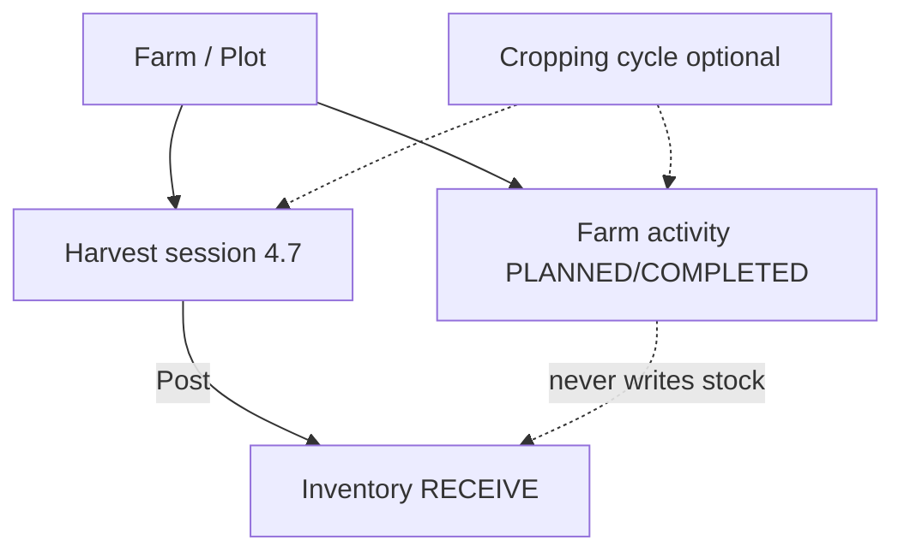

# Phase 4.8 — Farm Activities Architecture

**Status:** **Closed** — staging + M13 on-device validated; git closeout in progress  
**Date:** 2026-07-16 (approved) · Closed 2026-07-17  
**Version:** 1.0  
**Parent:** [Phase 4 — Farmer Platform](phase-4-farmer-platform-design.md) (Approved)  
**Depends on:** Phase 4.1 Farms · 4.2 Inventory · 4.3 Warehouse · 4.4 Listing ↔ Stock · 4.5 Production Planning · 4.6 Dashboards · 4.7 Harvest (**Closed** on staging)  
**Reference:** [Nahu Farm V1 Architecture Overview](../02-architecture/nahu-farm-v1-architecture-overview.md)  
**Next:** Production promotion (**explicit approval only**)

**Implementation gate:** **Complete on staging** — SQL → Prisma → API → Tests → Docs → Staging → Mobile (M13) → APK → Validation. Production remains **unchanged** until explicitly approved.

**Production:** Remains unchanged until an explicit production promotion.

**Program notes:** Farmer Amharic UI review is **completed** as a separate follow-up (`milestone-amharic-localization-v1`). Buyer app unchanged in this phase.

**§14 decisions locked at approval:**

| # | Decision |
|---|----------|
| 1 | Hard delete: `PLANNED` always; `COMPLETED` only if `occurred_on` is today (UTC calendar day); otherwise cancel |
| 2 | Default create status: **`COMPLETED`** (quick log) |
| 3 | Nullable `harvest_session_id` reserved in first migration |
| 4 | Dashboard: **no** contract change in MVP |
| 5 | Optional measure fields (`measure_qty` / `area_ha` / `product_id`) in MVP |
| 6 | Cost amount: **deferred** |
| 7 | Mobile label: **Activities** |

---

## 0. Purpose and review goals

Define **farm field activities** for Nahu Farm: how farmers log **what was done on the farm or plot** (and optionally against a production plan)—planting, inputs, irrigation, crop care, scouting, and harvest *support*—without redesigning Farms, Harvest Sessions, Inventory, Warehouse, or Dashboards.

This review package is intended so product/engineering can verify:

1. **Activity model** — farm- and plot-scoped logs with standard activity types  
2. **Production plan integration** — optional bind to cropping cycles where applicable  
3. **Separation from Harvest (4.7)** — activities never create stock; yield still goes through Harvest → Inventory RECEIVE  
4. **Notes / attachments** — MVP notes + forward-compatible attachment hooks  
5. **Future labour, machinery, and cost** — additive without entity redesign  
6. **Future AI / analytics** — stable features and metadata without a separate warehouse  
7. **Backward compatibility** with closed V1 Farm modules  
8. **Mobile UX (M13)** additive path and explicit out-of-scope  

---

## 1. Business objectives and scope

### 1.1 Objectives

1. Give farmers a clear way to **record farm / plot activities** that match field practice (spray day, irrigation run, prune pass, scouting visit, etc.).  
2. Support activities at **Farm** level and **Plot** level (plot optional).  
3. Optionally bind an activity to a **production plan** (`cropping_cycle`) when work relates to a season/plan.  
4. Provide **standard activity types** out of the box (seedable, extensible codes—not a forever-closed app enum).  
5. Keep an **ops log** that is independent of inventory and harvest posting.  
6. Capture MVP context: type, when, where (farm/plot), optional plan, notes; reserve attachments.  
7. Stay coffee-first, multi-commodity-ready; Farmer additive; **Buyer unchanged**.  
8. Leave clean hooks for **labour, machinery, cost**, richer inputs inventory, and **AI / analytics**.

### 1.2 In scope (build only after approval + authorize)

| Area | Proposal |
|------|----------|
| Domain | `farms.activity_types` (lookup) + `farms.farm_activities` (log) |
| Scope | Required `farm_id`; optional `plot_id`; optional `cropping_cycle_id` |
| Types (seed) | Planting · Fertilizer · Irrigation · Spraying · Weeding · Pruning · Scouting · Harvesting support · Other |
| Lifecycle | `PLANNED` \| `COMPLETED` \| `CANCELLED` (default create = `COMPLETED` for quick log UX) |
| Notes | Optional free-text notes |
| Attachments | MVP: optional `attachment_urls TEXT[]` (same pattern as harvest/listing photos); richer media service later |
| Optional quantities | Nullable structured fields for “how much / over what area” when useful (e.g. fert qty, area ha)—not an inventory write |
| Auth | JWT + FARMER; farm-party scoped (same as Farms) |
| Mobile (M13) | Additive Activities UX after staging API smoke |
| Docs | Feature mapping + API README + data dictionary |

### 1.3 Out of scope

| Deferred | When |
|----------|------|
| Labour roster, wages, piece-rate, time sheets | Future labour / payroll module (FK to `farm_activity_id`) |
| Machinery / equipment registry & depreciation | Future equipment module |
| Cost ledger / COGS / input purchases as SoR | Future cost / finance track (optional amount fields only as soft notes in 4.8) |
| Input stock (seed bags, chemical inventory) | Future inputs inventory (distinct from coffee/product lots) |
| Auto-creating Harvest Sessions from “Harvesting support” | Never implied — harvest remains 4.7 |
| Writing Inventory / Warehouse movements from activities | Not in 4.8 — activities do not touch stock SoR |
| Changing Dashboard contract (required) | Optional later activity summary card — not required for MVP |
| Weather auto-scheduling / AI auto-task generation | Future advisory / AI |
| Field / ProductionUnit required scoping | Schema may allow nullable later FKs; MVP = farm + optional plot |
| Buyer / Delivery / production Nest cutover | Unchanged; cutover = explicit gate |
| Amharic copy cleanup | Separate follow-up |

---

## 2. Domain separation (invariants)

```
Farm / Plot / Cropping cycle (4.1 / 4.5)   → where / which plan
Farm Activities (4.8)                     → ops log (what was done / planned)
Harvest Sessions (4.7)                    → yield capture → Post → Inventory RECEIVE
Inventory / Warehouse (4.2 / 4.3)         → stock SoR (unchanged)
Dashboard (4.6)                           → read model (optional future activity cards)
```

| Rule | Meaning |
|------|---------|
| Activity ≠ inventory | Creating/editing an activity never creates lots or moves balances |
| Activity ≠ harvest session | Yield posting remains exclusively 4.7 → Inventory RECEIVE |
| Harvesting support ≠ harvest | Activity type `HARVESTING_SUPPORT` is labour/ops context only |
| Plan bind is optional | Activities may exist without a cropping cycle |
| Plot bind is optional | Farm-wide activity allowed; if `plot_id` set it must belong to `farm_id` |
| Cycle bind integrity | If `cropping_cycle_id` set, cycle must belong to same farm; optional plot consistency with cycle.plot when both set |
| Lookups are codes | Activity types are rows (seedable), not hard-coded Nest enums only |
| Existing modules stable | No breaking API or schema changes to closed V1 Farm surfaces |

---

## 3. Positioning

```
Identity
  ↓
Farms / Plots / Cropping cycles (plans)
  ↓
Farm Activities (4.8)          ← ops timeline (PLANNED / COMPLETED)
  ║  (parallel to — not replacing)
  ↓
Harvest Management (4.7)       ← Session → Lines → Post → Inventory
  ↓
Inventory · Warehouse · Listings · Dashboard · future labour / cost / AI
```

**Today’s gap (after V1):** Farmers can plan and harvest into stock, but cannot systematically record **field work** (spray, irrigate, prune, scout) that drives quality, compliance, advisory, and future cost/AI features. Phase 4.5 deferred “field-task / operational activity logging”; Phase 4.7 deferred “farm activity ops.” **4.8 closes that gap.**

---

## 4. Activity model (proposed)

### 4.1 Primary entities

| Entity | Role |
|--------|------|
| **ActivityType** | Stable code + EN/AM labels + sort + active flag |
| **FarmActivity** | One logged or planned activity event |

**No activity-line child table in MVP.** One row = one activity event. Future input-detail lines (multiple products/chemicals) can add `farm_activity_inputs` keyed by `farm_activity_id` without changing the header.

### 4.2 Standard activity types (seed)

| Code | Meaning (EN) | Typical use |
|------|--------------|-------------|
| `PLANTING` | Planting / establishment | Seedlings, transplants, new coffee trees |
| `FERTILIZER` | Fertilizer application | Organic/mineral application event |
| `IRRIGATION` | Irrigation | Watering run / schedule completion |
| `SPRAYING` | Spraying / crop protection | Pesticide / fungicide / foliar spray |
| `WEEDING` | Weeding | Manual or mechanical weed control |
| `PRUNING` | Pruning | Canopy / training pruning |
| `SCOUTING` | Scouting / inspection | Pest, disease, maturity checks |
| `HARVESTING_SUPPORT` | Harvesting support | Prep, picking crew support, logistics at field — **not** yield posting |
| `OTHER` | Other | Catch-all; free-text notes clarify |

Types are **extensible** via additional rows (`is_active`, `sort_order`). Mobile lists active types only.

### 4.3 Lifecycle

| Status | Meaning |
|--------|---------|
| `PLANNED` | Scheduled / intended work not yet done |
| `COMPLETED` | Work performed (or logged after the fact) |
| `CANCELLED` | Planned work cancelled (soft; keep history) |

**Recommended UX default:** quick “Log activity” creates **`COMPLETED`** with `occurred_on` = today. “Schedule” creates **`PLANNED`** with `scheduled_on`.

| Mutation rule | Policy |
|---------------|--------|
| Edit | Allowed for `PLANNED` and `COMPLETED` (notes/date/type corrections) within farm write scope |
| Cancel | `PLANNED` → `CANCELLED`; completed cancel optional (or soft-flag only)—**recommend** allow cancel of PLANNED; COMPLETED stays unless hard-delete policy below |
| Delete | Soft-prefer: **no hard delete** of COMPLETED (archive/cancel pattern). Hard delete only for mistaken `PLANNED` / same-day COMPLETED if product prefers — **decision for review** (see §14) |

**Proposal for approval:** Hard delete allowed only while `PLANNED` or within a short “same calendar day” window for COMPLETED; otherwise cancel / correct in place. Final rule locked at approval.

### 4.4 Optional measures (structured, not stock)

Nullable fields for analytics / future cost without inventing input SoR:

| Field | Use |
|-------|-----|
| `measure_qty` + `measure_unit_code` | Optional applied quantity (e.g. kg fertilizer, liters spray mix) |
| `area_ha` | Optional treated / worked area |
| `product_id` | Optional catalog product when activity is crop-specific (e.g. coffee block spray) |
| `crew_count` | Optional headcount (same MVP stance as harvest) |
| `metadata` JSONB | Model tags, advisory IDs, chemical names not yet modeled, AI features |

These **do not** debit inventory. Future inputs warehouse may later link or consume separately.

---

## 5. Schema sketch (SQL-first, after approval)

All tables in existing schema **`farms`**. Migration naming convention: `database/migrations/farms/009_farms_farm_activities.sql` (number confirmed at implement time).

```
farms.activity_types
  code VARCHAR(40) PK
  name_en VARCHAR(100) NOT NULL
  name_am VARCHAR(100) NOT NULL
  description_en TEXT NULL
  description_am TEXT NULL
  is_active BOOLEAN NOT NULL DEFAULT true
  sort_order SMALLINT NOT NULL DEFAULT 0
  created_at, updated_at

farms.farm_activity_status  -- enum or check: PLANNED | COMPLETED | CANCELLED

farms.farm_activities
  id UUID PK
  farm_id UUID NOT NULL → farms.farms
  plot_id UUID NULL → farms.plots
  cropping_cycle_id UUID NULL → farms.cropping_cycles
  activity_type_code VARCHAR(40) NOT NULL → activity_types
  status farm_activity_status NOT NULL DEFAULT 'COMPLETED'
  occurred_on DATE NULL                 -- required when COMPLETED
  scheduled_on DATE NULL                -- for PLANNED (and optional retained after complete)
  occurred_at TIMESTAMPTZ NULL           -- optional time precision
  notes TEXT NULL
  attachment_urls TEXT[] NOT NULL DEFAULT '{}'
  measure_qty NUMERIC(14,3) NULL
  measure_unit_code VARCHAR(20) NULL → catalog.units
  area_ha NUMERIC(10,2) NULL
  product_id UUID NULL → catalog.products
  crew_count INT NULL
  -- reserved nullable FKs for future modules (NULL in 4.8; no child tables yet):
  -- harvest_session_id UUID NULL → harvest_sessions   (optional link for HARVESTING_SUPPORT)
  -- (equipment_id / cost fields intentionally NOT created until those modules land—
  --  use metadata for interim tags; add nullable FKs in later migrations)
  metadata JSONB NULL
  created_by_user_id UUID NULL → identity.users
  created_at, updated_at

Indexes: (farm_id, occurred_on DESC), (farm_id, activity_type_code),
         (cropping_cycle_id), (plot_id), (status)
```

**Integrity (service + DB checks):**

- `plot_id` farm match  
- `cropping_cycle_id` farm match  
- If both plot and cycle set and cycle has `plot_id`, they must match (or cycle.plot is null)  
- `COMPLETED` ⇒ `occurred_on` NOT NULL  
- `PLANNED` ⇒ `scheduled_on` NOT NULL  
- `measure_unit_code` required iff `measure_qty` set  

### 5.1 Seed data

Insert the nine codes in §4.2 on migration. Prefer idempotent `INSERT … ON CONFLICT DO NOTHING`.

---

## 6. Relationship to Harvest, Inventory, Warehouse, Dashboard

| Module | Integration in 4.8 |
|--------|---------------------|
| **Farms / Plots** | Required scope; party auth unchanged |
| **Cropping cycles (4.5)** | Optional `cropping_cycle_id`; no auto lifecycle changes from activities |
| **Harvest (4.7)** | Parallel domain; optional future `harvest_session_id` link for support activities; **no** post/RECEIVE from activities |
| **Inventory (4.2)** | **No writes.** Direct receive / harvest post remain the only stock paths |
| **Warehouse (4.3)** | No storage-site requirement on activities |
| **Listings / Orders** | Unchanged |
| **Dashboard (4.6)** | MVP: **no required contract change**. Optional later additive section (e.g. “activities this week”) — clients already ignore unknown keys |

---

## 7. API design (draft)

| Method | Path | Purpose |
|--------|------|---------|
| `GET` | `/activity-types` | List active types (public or FARMER) |
| `GET` | `/farms/:farmId/activities` | List (filters: status, type, plotId, croppingCycleId, fromDate, toDate) |
| `POST` | `/farms/:farmId/activities` | Create activity |
| `GET` | `/farm-activities/:id` | Detail |
| `PATCH` | `/farm-activities/:id` | Update (per mutation policy) |
| `POST` | `/farm-activities/:id/cancel` | Set CANCELLED |
| `DELETE` | `/farm-activities/:id` | Delete only when policy allows (see §4.3 / §14) |
| `GET` | `/farms/:farmId/activity-history` | Convenience timeline for mobile (COMPLETED first) |
| `GET` | `/cropping-cycles/:id/activities` | Optional: activities for one plan |

### 7.1 Nest module placement

Prefer **`FarmActivitiesModule`** (or `ActivitiesModule` under `apps/api/src/farms/`) that **imports `FarmsModule` only**—mirrors HarvestModule’s avoid-circular pattern. No Inventory import in 4.8.

### 7.2 Auth

JWT + `FARMER`. Farm-party write for mutate; read for list/history.

### 7.3 Errors

| Case | Code |
|------|------|
| Unknown type / inactive type | 400 |
| Plot / cycle not on farm | 400 |
| COMPLETED without `occurred_on` | 400 |
| Delete forbidden by policy | 400 |
| Unknown activity / farm | 404 |

---

## 8. Mobile UX (M13) — additive

Suggested Farmer entry points (after staging smoke):

| Entry | Behavior |
|-------|----------|
| Settings → **Activities** | Farm filter + timeline + “Log activity” |
| Farm detail | View all / Log activity (farm prefilled) |
| Plot context (from farm detail) | Prefill plot |
| Cropping cycle detail | Optional “Activities for this plan” + log with cycle prefilled |

Screens (indicative): Activity list · Activity form · Activity detail.  
Amharic: unicode-safe i18n helper (same pattern as harvest/dashboard); full Amharic cleanup still a separate program follow-up.

**Buyer:** unchanged.

---

## 9. Future extensibility (design intent)

`farm_activities` header remains stable. Later capabilities attach **additively**:

| Future area | Additive hook |
|-------------|----------------|
| Labour / payroll | Child roster / time entries keyed by `farm_activity_id`; keep `crew_count` |
| Machinery / equipment | Nullable `equipment_id` + usage child table |
| Cost / finance | Optional `estimated_cost` / currency later; or cost journal lines FK’d to activity—**not** SoR in 4.8 |
| Input stock | `farm_activity_inputs` lines (product/chemical qty) + optional consume from future inputs inventory |
| Attachments / docs | `attachment_urls` → later media object IDs / `farm_activity_attachments` table |
| AI / analytics | `activity_type_code`, dates, farm/plot/cycle, measures, `metadata` as features; advisory can suggest PLANNED rows |
| Weather | Advisory may propose irrigation/spray windows; activities remain farmer-owned facts |
| Harvest link | Nullable `harvest_session_id` for `HARVESTING_SUPPORT` context |
| Compliance / MoA | Exportable activity history by farm/season |

**Non-goals of extensibility:** do not require redesign of Inventory receive, Harvest Session→Lines, or 4.5 performance formulas.

---

## 10. Data flow (ops + production)



Illustrative season story:

1. Plan Belg cycle (4.5)  
2. Log `PLANTING`, then `FERTILIZER` / `IRRIGATION` / `SPRAYING` / `PRUNING` / `SCOUTING` against farm/plot/(cycle)  
3. Log `HARVESTING_SUPPORT` on pick days (optional)  
4. Record **Harvest Sessions** and **Post** to inventory (4.7)  
5. Dashboard continues to show farm / inventory / production — activities may appear later as an additive card  

---

## 11. Backward compatibility checklist

| Surface | 4.8 impact |
|---------|------------|
| Farm / plot APIs | Unchanged |
| Cropping cycle APIs | Unchanged (new optional reverse list endpoint only) |
| Harvest APIs | Unchanged |
| Inventory / warehouse APIs | Unchanged |
| Dashboard payload | Unchanged for MVP |
| Listing / order APIs | Unchanged |
| Buyer app | Unchanged |
| Existing Farmer screens | Additive navigation only |

---

## 12. Testing plan (after authorize)

| Layer | Focus |
|-------|-------|
| Rules unit tests | Plot/cycle farm integrity; COMPLETED requires date; type must be active; delete/cancel policy |
| API smoke (staging) | Create types list; create COMPLETED farm activity; plot-scoped; cycle-scoped; cancel planned; filters |
| Mobile M13 | Log from Settings / Farm / Plan; Amharic labels for seed types |
| Regression | Harvest post still RECEIVEs; dashboard still loads; inventory balances unchanged by activity create |

---

## 13. Documentation deliverables (after authorize)

- [API README](../../apps/api/README.md) Phase 4.8 section  
- [Data dictionary](../../database/docs/data-dictionary.md)  
- [Backend ↔ Mobile mapping](../backend-mobile-feature-mapping.md) — M13 / B8  
- Parent Phase 4 roadmap row → Closed when done  
- Optional: extend [Nahu Farm V1 overview](../02-architecture/nahu-farm-v1-architecture-overview.md) or V1.1 addendum when 4.8 closes  

---

## 14. Open review questions

Please decide / confirm before **Approval**:

1. **Delete policy:** Hard-delete only `PLANNED`, vs short COMPLETED window, vs never hard-delete?  
2. **Default create status:** `COMPLETED` (quick log) vs always choose in UI?  
3. **HARVESTING_SUPPORT:** Keep as activity type only, or also reserve `harvest_session_id` FK in the first migration?  
4. **Dashboard:** Explicitly **no** section in M13 MVP (recommended), or minimal “recent activities” in `GET /farms/dashboard`?  
5. **Measure fields:** Keep optional `measure_qty` / `area_ha` / `product_id` in MVP, or notes-only for first slice?  
6. **Cost amount:** Soft optional `estimated_cost_etb` in MVP, or strictly deferred?  
7. **Mobile label:** “Activities” vs “Field work” vs Amharic-primary product name?  

---

## 15. Decision log (for approval)

| # | Topic | Proposal | Status |
|---|-------|----------|--------|
| D1 | Primary model | `activity_types` + `farm_activities` (no lines in MVP) | **Approved** |
| D2 | Scope | Farm required; plot optional; cropping cycle optional | **Approved** |
| D3 | Seed types | Nine codes in §4.2 | **Approved** |
| D4 | Lifecycle | PLANNED / COMPLETED / CANCELLED | **Approved** |
| D5 | Stock / harvest | Activities never write inventory; never replace 4.7 | **Approved** |
| D6 | Notes / attachments | Notes + `attachment_urls[]` | **Approved** |
| D7 | Labour / machinery / cost | Deferred modules; `crew_count` + `metadata` + future FKs | **Approved** |
| D8 | AI / analytics | Stable type/date/scope/measures/metadata | **Approved** |
| D9 | Nest placement | Dedicated activities module importing Farms only | **Approved** |
| D10 | Dashboard | No required contract change in MVP | **Approved** |
| D11 | Production | Held until explicit approval | **Locked** |
| D12 | Buyer | Unchanged | **Locked** |
| D13 | Delete / defaults / harvest_session FK / measures / label | Per §14 table above | **Approved** |

---

## 16. Implementation sequence (only after Approval)

1. SQL migration (`activity_types` seed + `farm_activities`)  
2. Prisma models + Nest FarmActivities module  
3. Rules tests + API README / dictionary / mapping  
4. Staging deploy + smoke  
5. Farmer M13 UI + APK  
6. On-device validation → Commit → PR → Merge → Tag  
7. Production: **explicit gate only**

---

## 17. Approval checklist

- [ ] Farm + plot (+ optional plan) scoping accepted  
- [ ] Standard activity type list accepted (or adjusted)  
- [ ] Separation from Harvest / Inventory accepted  
- [ ] Notes + attachment forward-compat accepted  
- [ ] Future labour / machinery / cost / AI hooks accepted  
- [ ] Open questions in §14 resolved  
- [ ] Backward compatibility with V1 Farm modules accepted  
- [ ] Production held acknowledged  
- [ ] **Approval** to authorize implementation workflow  

**Reply to authorize later:** e.g. `4.8 design approved` (with any §14 decisions). Until then: **design only**.
