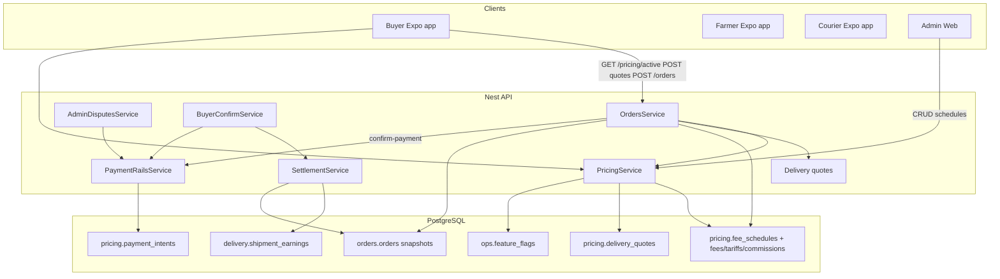
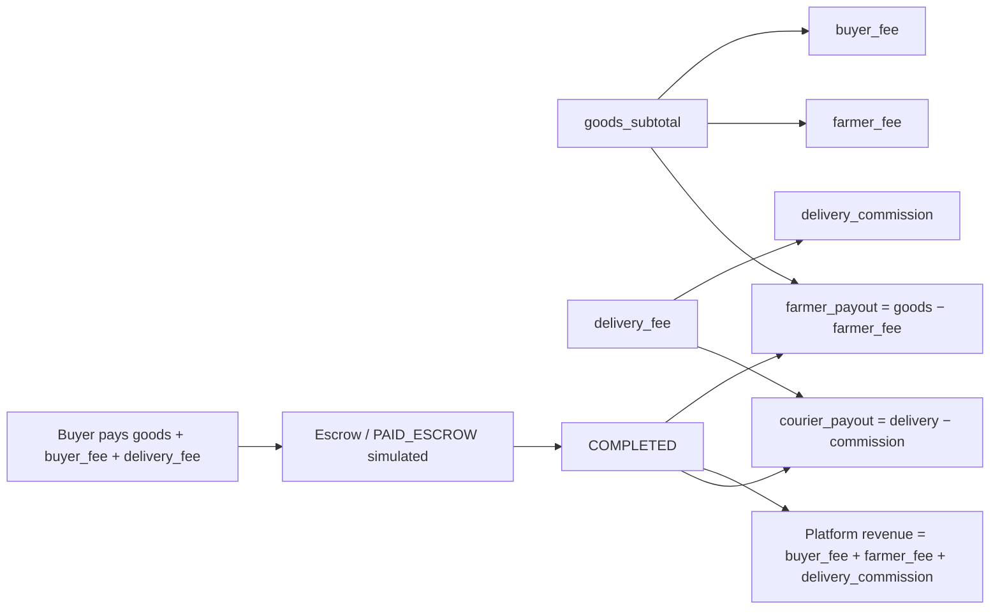
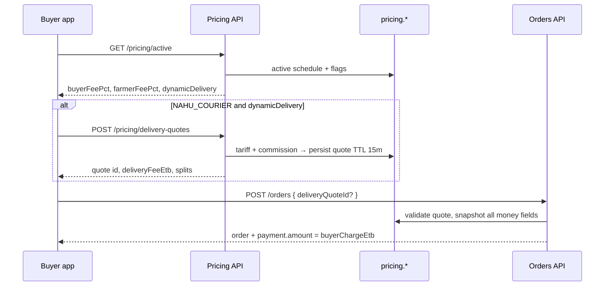
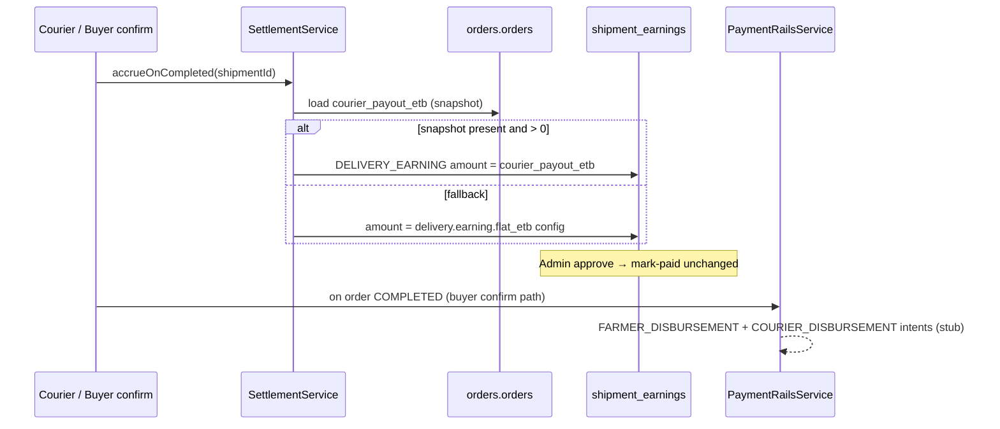
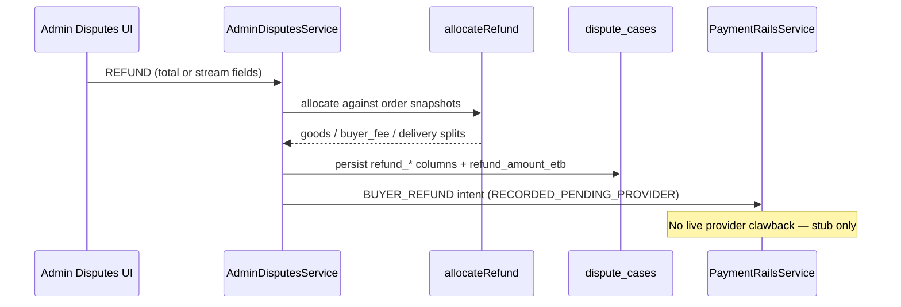

# Revenue Engine — Technical Design Document

**Status:** Architecture approved (2026-07-27) with production-gate comments  
**Plan reference:** `revenue_engine_architecture_ea93abf6`  
**Design lock:** [revenue-engine-design-lock.md](./revenue-engine-design-lock.md)  
**Follow-ups:** [revenue-engine-roadmap.md](./revenue-engine-roadmap.md)

**Scope:** Accounting-first revenue engine — versioned DB schedules → immutable order snapshots → optional delivery quotes → courier payout snapshots → refund/payment *intents*. Live payment-provider capture and disbursement are **out of scope** until provider integrations land.

---

## Approval summary

Approved:

- Versioned pricing schedules
- Immutable order fee snapshots
- Configurable platform fees and delivery tariffs (Admin Portal)
- Delivery quote workflow
- Courier payout snapshots
- Payment intent abstraction

**Production gates (must hold until follow-ups ship):**

1. Keep `delivery.dynamic_fee.enabled` **disabled** until routing, vehicle selection, and real delivery distance are implemented.
2. All pricing rates/tariffs are editable **only** through the Admin Portal (source of truth: `pricing.*` tables).
3. Treat `pricing.payment_intents` as **accounting stubs only** until a live payment provider is integrated.

No further product implementation is required until roadmap items are prioritised.

---

## 1. Overall Architecture

### 1.1 High-level architecture



### 1.2 Revenue flow (locked incidence)



### 1.3 Delivery pricing flow



**Gate:** With `delivery.dynamic_fee.enabled = false`, courier orders do **not** require a quote; `delivery_fee_etb` / commission / courier payout snapshot as **0**. Marketplace buyer/farmer fees still apply when `pricing.v1.enabled`.

### 1.4 Settlement flow



### 1.5 Refund flow



---

## 2. Database Changes

### 2.1 Migrations (manifest order)

| Migration | Purpose |
|-----------|---------|
| `pricing/001_pricing_schema.sql` | Create `pricing` schema |
| `pricing/002_pricing_fee_schedules.sql` | Schedules, platform fees, tariffs, commissions + seed default |
| `ops/010_ops_pricing_feature_flags.sql` | Seed flags; **dynamic delivery seeded FALSE** |
| `orders/012_orders_revenue_fee_snapshots.sql` | Order money snapshot columns + backfill |
| `pricing/003_pricing_delivery_quotes.sql` | Quote table |
| `orders/013_orders_dispute_refund_allocation.sql` | Dispute refund stream columns |
| `pricing/004_pricing_payment_rail_stubs.sql` | Payment intent ledger (stubs) |
| `ops/011_ops_disable_dynamic_delivery_fee.sql` | Force `delivery.dynamic_fee.enabled = FALSE` on existing DBs |

### 2.2 New tables

| Table | Purpose |
|-------|---------|
| `pricing.fee_schedules` | Named, versioned schedule (`code`+`version`), `is_active`, effective window |
| `pricing.platform_fees` | Per schedule: `buyer_fee_pct`, `farmer_fee_pct` |
| `pricing.delivery_tariffs` | Per schedule × `vehicle_type`: base, per_km, per_kg, per_m3, min/max |
| `pricing.delivery_commissions` | Per schedule: `PERCENT` or `FIXED` take on delivery fee |
| `pricing.delivery_quotes` | Checkout quote: inputs + computed fee/commission/payout, TTL, optional `order_id` |
| `pricing.payment_intents` | Stub ledger for capture / disbursement / refund intents |

### 2.3 Modified tables — new columns

**`orders.orders`**

| Column | Purpose |
|--------|---------|
| `goods_subtotal_etb` | Listing amount (price × qty); same semantic as legacy `total_etb` going forward |
| `buyer_fee_etb` | Buyer platform fee snapshot |
| `farmer_fee_etb` | Farmer platform fee snapshot |
| `delivery_fee_etb` | Buyer-paid delivery snapshot |
| `delivery_commission_etb` | Platform retain on delivery |
| `courier_payout_etb` | Courier earn amount snapshot |
| `buyer_charge_etb` | What buyer pays = goods + buyer fee + delivery |
| `fee_schedule_id` | Schedule used at create |
| `delivery_quote_id` | Bound quote (courier path when dynamic fees on) |

**Legacy dual-write:** `total_etb` remains **goods subtotal**; `commission_etb` remains **farmer fee** for old clients.

**`orders.dispute_cases`**

| Column | Purpose |
|--------|---------|
| `refund_goods_etb` | Intent allocation to goods |
| `refund_buyer_fee_etb` | Intent allocation to buyer fee |
| `refund_delivery_etb` | Intent allocation to delivery |
| `refund_policy_code` | e.g. `manual`, `manual_streams`, waterfall code |

### 2.4 Seed defaults (Admin-editable)

| Setting | Seed |
|---------|------|
| Buyer fee | 2% |
| Farmer fee | 2% |
| Delivery commission | 15% PERCENT |
| Vehicles | BICYCLE, MOTORBIKE, CAR, PICKUP, VAN, TRUCK, OTHER |
| `pricing.v1.enabled` | TRUE |
| `delivery.dynamic_fee.enabled` | **FALSE** |

---

## 3. Fee Calculation

Rounding: **2 decimal places ETB** via `roundEtb` in `apps/api/src/pricing/pricing.rules.ts`.

### 3.1 Formulas

| Stream | Formula |
|--------|---------|
| Goods | `price_per_unit × quantity` (order contract) |
| Buyer platform fee | `round(goods × buyer_fee_pct / 100)` |
| Farmer platform fee | `round(goods × farmer_fee_pct / 100)` |
| Farmer payout | `round(goods − farmer_fee)` |
| Delivery fee | See §4 (0 while dynamic fee flag is off) |
| Nahu delivery commission | `PERCENT`: `round(fee × value/100)`; `FIXED`: `min(fee, value)` |
| Courier payout | `round(delivery_fee − delivery_commission)` |
| Buyer charge | `round(goods + buyer_fee + delivery_fee)` |

Platform revenue (conceptual until Finance Ledger ships):

`buyer_fee + farmer_fee + delivery_commission`

### 3.2 Worked example — marketplace (typical with dynamic delivery off)

Inputs: goods = **1,000 ETB**, buyer 2%, farmer 2%, delivery = 0

| Line | ETB |
|------|-----|
| Goods | 1,000.00 |
| Buyer fee | 20.00 |
| Farmer fee | 20.00 |
| Delivery | 0 |
| **Buyer pays** | **1,020.00** |
| Farmer receives | 980.00 |
| Courier | 0 |
| Platform | 40.00 |

### 3.3 Worked example — with courier (when flag enabled)

MOTORBIKE: base 60, 8/km, 1/kg · distance 10 km · weight 20 kg → fee **160**  
Commission 15% → 24 · courier 136 · goods 1,000 @ 2%/2%:

| Line | ETB |
|------|-----|
| Goods | 1,000.00 |
| Buyer fee | 20.00 |
| Delivery | 160.00 |
| **Buyer pays** | **1,180.00** |
| Farmer | 980.00 |
| Delivery commission | 24.00 |
| Courier payout | 136.00 |
| Platform | 64.00 |

---

## 4. Delivery Pricing

### 4.1 Quote formula (implemented; gated by flag)

```
raw = base_fare
    + per_km × distance_km
    + per_kg × weight_kg
    + per_m3 × volume_m3

fee = clamp(round(raw), min_fare, max_fare?)
```

Commission split is snapshotted on the quote row. Quote TTL: **15 minutes** (service constant; future: Admin setting).

### 4.2 Inputs

| Input | Modelled? | Used in calc? | Production-ready? |
|-------|-----------|---------------|-------------------|
| Vehicle type | Yes | Yes | Needs Buyer App selection (roadmap) |
| Distance (km) | Yes | Yes | Needs real routing (roadmap) |
| Weight (kg) | Yes | Yes | Qty proxy acceptable interim |
| Volume (m³) | Yes | Yes if sent | Optional / later |
| Base / per km / kg / m³ / min / max | Yes | Yes | Admin Portal |
| Geo routing | Shipment fields exist | Not at checkout | Roadmap |
| Surge / zone | No | No | Future |

### 4.3 Binding rules (when flag on)

- Required for `NAHU_COURIER` when `delivery.dynamic_fee.enabled`
- Quote must be unexpired, unused, owned by buyer
- On create: amounts copied to order; quote gets `order_id`
- Pickup / seller delivery: delivery fee = 0, no quote

---

## 5. Settlement Flow

```text
1. Checkout
   Rates from GET /pricing/active
   Quote only if dynamic delivery enabled
   POST /orders snapshots fee fields
   payment.amount = buyer_charge_etb

2. Buyer payment (simulated)
   confirm-payment → PAID_ESCROW
   PaymentRails: BUYER_CAPTURE intent (stub)

3. Escrow hold
   Existing order status machine
   Farmer sees farmer_payout_etb
   Cash not moved

4. Delivery execution
   Shipment + POD as before

5. Commercial completion
   Settlement.accrueOnCompleted uses order.courier_payout_etb
   (else flat earning config fallback)
   Buyer-confirm path also accrues (idempotent)

6. Disbursement intents (stub)
   FARMER_DISBURSEMENT / COURIER_DISBURSEMENT
   status RECORDED_PENDING_PROVIDER — not live money movement

7. Platform revenue
   Sum of snapshotted fee streams (Finance Ledger roadmap)
```

---

## 6. Refund Handling

| Scenario | Design intent | Current behaviour |
|----------|---------------|-------------------|
| Cancel before pay | N/A | Order cancel |
| Cancel after pay, before pickup | Full refund all streams | Manual admin REFUND |
| Farmer rejects | Per ops | Manual / existing actions |
| Courier fails (courier fault) | Refund streams; reverse earn | Manual streams + ledger reverse |
| Buyer unavailable | Often keep fee; partial courier | Manual |
| Partial / full / delivery-only / goods-only | Explicit streams | `allocateRefund` + dispute columns |
| Automated policy matrix | Roadmap | Not implemented |

Allocation:

1. Explicit stream fields → clamp to snapshot caps  
2. Else total amount → waterfall goods → buyer fee → delivery  

Writes `BUYER_REFUND` payment intent (stub). Does not auto-reverse courier earnings.

---

## 7. Admin Pricing

**Route:** `/pricing`  
**Permissions:** `admin.system.config.read` / `.write`

### Configurable fields (Admin only — source of truth)

| Area | Fields |
|------|--------|
| Platform fees | `buyerFeePct`, `farmerFeePct` (0–100) |
| Delivery commission | `commissionType` (`PERCENT` \| `FIXED`), `commissionValue` |
| Vehicle tariff | `vehicleType`, `baseFareEtb`, `perKmEtb`, `perKgEtb`, `perM3Etb`, `minFareEtb`, `maxFareEtb`, `isActive` |
| Feature flags | System page: `pricing.v1.enabled`, `delivery.dynamic_fee.enabled` |

Related: order detail fee breakdown + payment intents; dispute stream refund UI.

**Policy:** Apps must display server rates (`GET /pricing/active`). Clients must not be the source of truth for percentages or tariffs.

---

## 8. Configuration

### Configurable

| Value | Where |
|-------|--------|
| Buyer / farmer fee % | `pricing.platform_fees` via Admin |
| Delivery commission | `pricing.delivery_commissions` via Admin |
| Vehicle tariffs | `pricing.delivery_tariffs` via Admin |
| Active schedule | `pricing.fee_schedules` |
| Feature flags | `ops.feature_flags` via Admin System |
| Flat earning fallback | Existing delivery config |

### Acceptable interim constants (not production rate sources)

| Item | Note |
|------|------|
| Quote TTL 15m | Service constant until Admin setting |
| Flag-off marketplace fallback | If `pricing.v1` off: buyer 0% / farmer 2% legacy |
| Currency `ETB` | Schema default; multi-country later |

### Explicitly not production pricing inputs

Buyer-app hardcoded distance (10 km) and vehicle (`MOTORBIKE`) must **not** be used in production: keep `delivery.dynamic_fee.enabled` off until roadmap items land.

---

## 9. APIs

### Buyer / JWT

**`GET /pricing/active`** — active rates + flag state for checkout display.

**`POST /pricing/delivery-quotes`** — body: `vehicleType`, `distanceKm`, `weightKg`, optional `volumeM3`. Returns quote id, fees, `expiresAt`. Only meaningful when dynamic delivery is enabled.

### Orders

**`POST /orders`** — optional `deliveryQuoteId`; payment amount = `buyerChargeEtb`.

**`PATCH /orders/:id/confirm-payment`** — records stub `BUYER_CAPTURE` intent.

### Admin

| Method | Path | Permission |
|--------|------|------------|
| GET | `/admin/pricing/schedules` | `admin.system.config.read` |
| PATCH | `/admin/pricing/platform-fees` | `.write` |
| PATCH | `/admin/pricing/delivery-commission` | `.write` |
| PUT | `/admin/pricing/delivery-tariffs` | `.write` |

Admin BFF: `/api/pricing/*`.

### Disputes REFUND

Supports `refundAmountEtb` and/or `refundGoodsEtb` / `refundBuyerFeeEtb` / `refundDeliveryEtb` / `refundPolicyCode`.

### Payment rails

`PaymentRailsService` — internal stub recorder only. Intent types: `BUYER_CAPTURE`, `FARMER_DISBURSEMENT`, `COURIER_DISBURSEMENT`, `BUYER_REFUND`. Status starts at `RECORDED_PENDING_PROVIDER`. **No live Telebirr/Chapa/CBE calls.**

---

## 10. Testing

### Unit

`apps/api/src/pricing/pricing.rules.test.mjs` — marketplace fees, delivery fee, commission split, snapshot, refund waterfall.

### Gaps (acceptable until prioritised)

- Quote → order bind integration  
- Settlement override from snapshot  
- Dispute refund → payment intent  
- Flag on/off matrix e2e  

### Risks while dynamic fee is off

Marketplace fees still change buyer charge (goods + buyer fee). Confirm staging QA covers checkout totals and farmer payout display.

---

## 11. Future Extensions

| Extension | Fit |
|-----------|-----|
| General agri products | Fees on goods subtotal; category rules can feed quote inputs |
| More vehicle types | New tariff rows |
| Payment providers | Adapt `payment_intents` statuses/providers |
| Dynamic / surge pricing | New schedule version or multipliers; keep snapshots immutable |
| Promotions / discount codes | Apply before snapshot; do not rewrite history |
| VAT/GST | Tax lines on snapshot / schedule |
| Multi-country | Schedule by country/currency |

See [revenue-engine-roadmap.md](./revenue-engine-roadmap.md) for tracked follow-ups.

---

## Document history

| Date | Change |
|------|--------|
| 2026-07-27 | Initial TDD from architecture review |
| 2026-07-27 | Approved with gates: dynamic fee off; Admin-only rates; payment stubs only |
