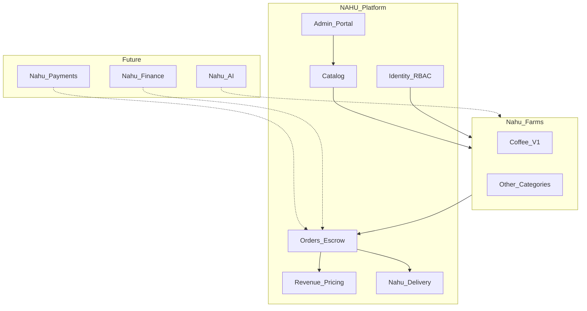

# 01 — NAHU Platform Vision

**Status:** Planning only  
**Date:** 2026-07-28  
**Parent:** [Platform Evolution index](./README.md)

---

## 1. Vision statement

**NAHU Platform** is Ethiopia’s digital agriculture operating system: a shared foundation for identity, catalog, marketplace commerce, escrow, pricing, delivery, and (later) payments, finance, and AI.

**Nahu Buna Gebeya** is not replaced. It becomes **Version 1** of a category-driven agricultural marketplace — the coffee vertical experience on top of the NAHU foundation.

Coffee remains a first-class product category. It ceases to be the implicit shape of every listing, certificate, and screen.

---

## 2. Target platform map

```text
NAHU Platform
│
├── Nahu Farms                    ← agri marketplace + farm ops
│   ├── Coffee                    ← V1 (Nahu Buna Gebeya experience)
│   ├── Cereals, Pulses, Oilseeds
│   ├── Fruits, Vegetables
│   ├── Livestock, Dairy, Poultry, Fish
│   ├── Honey, Flowers, Forestry
│   ├── Agricultural Inputs
│   └── Agricultural Services
│
├── Nahu Delivery                 ← shared logistics (RC1 foundation)
├── Nahu Payments                 ← live capture/disbursement (future)
├── Nahu Finance                  ← wallet, credit, insurance (future)
└── Nahu AI                       ← advisory, vision, prediction (future)
```



---

## 3. Brand hierarchy

| Layer | Brand | Role |
|-------|-------|------|
| Ecosystem | **NAHU Platform** | Corporate / architecture / Admin / APIs |
| Agri umbrella | **Nahu Farms** | Multi-category farm & marketplace product family |
| Coffee experience | **Nahu Buna Gebeya** | Buyer/Farmer coffee UX, store listings, coffee marketing until cutover |
| Logistics | **Nahu Delivery** | Courier app + shared shipment engine |
| Money (future) | **Nahu Payments** / **Nahu Finance** | Provider rails and financial products |
| Intelligence (future) | **Nahu AI** | Decision support products |

**Rule:** Engineering modules are platform-named; consumer apps may keep vertical brands (Buna Gebeya) without forking backends.

---

## 4. What already exists as platform foundation

| Capability | Today | Platform role |
|------------|-------|---------------|
| Identity / RBAC | Nest Identity | Shared across all modules |
| Catalog spine | `catalog.categories` → products → varieties → units | Multi-commodity ready; mostly coffee activated |
| Farm ops | Farms, harvest, inventory, warehouse | Product-FK based; not coffee-only |
| Marketplace sell/buy | Listings, orders, escrow | Structurally agnostic; **contract still coffee-heavy** |
| Revenue Engine | Fee schedules, snapshots, Admin Pricing | Category-agnostic money |
| Delivery | Shipments, POD, settlement | Category-agnostic logistics |
| Admin | Moderation, users, pricing, delivery ops | Needs catalog/attribute admin for multi-ag |
| Mobile | Buyer / Farmer / Courier | Coffee-first UX; Nest-backed |

---

## 5. Conceptual shift

| Coffee-centric (today’s UX/DDL bias) | Category-driven (target) |
|--------------------------------------|---------------------------|
| Coffee Listing | Listing (core) + category extension |
| Coffee Variety | Product Variety (catalog) |
| Coffee Grade | Quality standard / grade vocabulary per category |
| Coffee Processing Method | Coffee extension attribute |
| “Ethiopian Coffee” app copy | Category-aware discovery + coffee skin |

---

## 6. Future category coverage (design target)

The architecture must accommodate (without implying launch order):

**Crops / horticulture / specialty:** Coffee, wheat, barley, teff, maize, sorghum, rice, oats; chickpeas, lentils, beans, peas; sesame, niger seed, soybean, sunflower, groundnuts; mango, banana, avocado, citrus, papaya, apple, grapes; tomato, onion, potato, carrot, cabbage, pepper.

**Animal & specialty:** Cattle, sheep, goats, poultry, dairy, fisheries, honey, flowers, forestry products.

**Inputs:** Seeds, fertilizer, chemicals, irrigation, machinery, tractor parts, greenhouses, animal feed, veterinary products (where regulation allows).

**Services:** Tractor hire, harvesting, land preparation, irrigation, drone spraying/mapping, soil testing, agronomy consulting, AI advisory.

**Delivery beyond agri (same engine):** food, groceries, parcels, documents, building materials, furniture, pharmacy — via shipment domain, not by rewriting marketplace.

---

## 7. Module ownership principles

1. **One marketplace core** — do not create parallel “coffee marketplace” and “cereal marketplace” services.  
2. **Catalog owns what can be sold** — categories/products/varieties/units/attribute schemas.  
3. **Extensions own what differs** — coffee process, livestock age/sex, service duration.  
4. **Orders/Escrow/Pricing/Delivery never learn coffee enums** — they see money, qty, weight hints, addresses.  
5. **Vertical apps are experiences** — configuration + branding over code forks.  
6. **RC1 coffee flows stay green** while generalization lands behind flags and dual-write.

---

## 8. Success vision (18–36 months, directional)

- Sellers list any activated category with the same Farmer app shell.  
- Buyers discover by category with facet configs from the server.  
- Certificates use category templates (coffee origin remains the first template).  
- Delivery and Revenue Engine scale unchanged across categories.  
- Payments, Finance, and AI plug into escrow and farm data without a marketplace rewrite.
