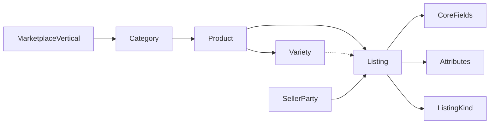

# 03 — Domain Model Refactoring Plan

**Status:** Planning only  
**Date:** 2026-07-28  
**Parent:** [Platform Evolution index](./README.md)  
**Related:** [Phase 3 catalog](../07-decisions/phase-3-product-catalog-design.md), G1 extension framework

---

## 1. Target conceptual model

```text
MarketplaceVertical (e.g. AGRICULTURE, CONSTRUCTION, …)
  └── Category (family)              e.g. COFFEE, CEREALS, LIVESTOCK, INPUTS, SERVICES
        └── Product (saleable type)  e.g. ETHIOPIAN_ARABICA_COFFEE, TEFF, UREA_FERTILIZER
              └── Variety (optional) e.g. HEIRLOOM, BOURBON / TEFF_SERGEGENE
                    └── Listing (offer)
                          ├── Core (generic)
                          └── Attributes / extensions (category-scoped)
```

**Naming:** Prefer existing **Category / Product** language. Product marketing may say “commodity”; engineering does not need a separate Commodity entity.  
**Forward vocabulary:** [17 — Terminology](./17-d3-terminology-guide.md). **Vertical:** [15](./15-d1-marketplace-vertical.md). **Seller:** [16](./16-d2-seller-party.md).



---

## 2. Listing core (all categories)

| Concept | Storage (today → target) | Notes |
|---------|--------------------------|-------|
| Product / category | FKs already | Required |
| Quantity + unit + price/unit | G1 columns | Canonical |
| Packaging | G1 optional | Bags, jars, crates |
| Location | region, woreda, farm, pickup | Generic |
| Photos / status / moderation | Existing | Generic |
| Harvest or offer date | harvest_date | API: `offerDate`; UI label by category ([17](./17-d3-terminology-guide.md)) |
| Farm / business profile | Optional FKs | Optional — never required for checkout ([21](./21-d7-platform-module-boundaries.md)) |
| Listing kind | **Add** on category or product | Canonical: `GOODS` / `SUPPLIES` / `SERVICE` (agri UI aliases: Produce / Inputs / Services) |
| Seller | farmer_id today | Conceptual **SellerParty**; physical bridge per [16](./16-d2-seller-party.md) |

Legacy dual-write: `quantity_kg` / `price_per_kg` remain for coffee KG clients until sunset (see DB plan).

---

## 3. Quality, specifications, standards

| Old coffee-centric name | Target concept | Coffee mapping |
|-------------------------|----------------|----------------|
| Coffee Grade | **Quality grade** (vocabulary per category) | GRADE_1…9 codes |
| Coffee Processing Method | **Product attribute** (coffee extension) | process_method |
| Coffee Variety | **Catalog variety** (FK preferred) | Today free-text on listing → migrate to `product_variety_id` |
| Cup score / washing station | **Coffee-only attributes** | Stay in extension |
| Origin certificate | **Certificate template** | `COFFEE_ORIGIN` template |

Generic “quality grade” may reuse the listing `grade` column short-term (`qualityGrade` API alias already exists) while vocabularies become category-scoped.

---

## 4. Listing kinds

| Kind (canonical) | Agri UI alias | Examples | Distinct needs |
|------------------|---------------|----------|----------------|
| **GOODS** | Produce | Coffee, teff, mango, honey, live animals* | Origin, quality, offer/harvest date; optional business profile/lot |
| **SUPPLIES** | Inputs | Seeds, fertilizer, pumps | Brand, composition, regulatory flags |
| **SERVICE** | Services | Tractor hire, soil test, advisory | Duration, coverage; scheduling later |

\*Live animals may need extra welfare/logistics attrs; still GOODS kind with livestock attribute pack.

Kinds are **configuration**, not separate microservices. See [17](./17-d3-terminology-guide.md).

---

## 5. Extension model (from G1 → G3)

### Today (G1)

```text
Listing API
  core: { product, qty, unit, price, location, …, qualityGrade? }
  extensions: { coffee: { processMethod, cupScore, washingStation, variety, altitudeM, … } }
```

Validation: `assertCoffeeExtensionRequirements` when `categoryCode === 'COFFEE'`.

### Target (G3)

```text
attribute_definitions   (category_id / product_id, code, data_type, required, enum_values, …)
listing_attribute_values (listing_id, definition_id, value_*)
```

Coffee columns remain as **physical dual-write** until readers prefer attributes; then deprecate NOT NULL coffee constraints.

---

## 6. Certificates domain

| Today | Target |
|-------|--------|
| `origin_certificates` with coffee-required grade/process | **Product quality / origin certificate** |
| Always shaped as `extensions.coffee` | Certificate **template** drives snapshot fields |
| Issued on order complete | Same trigger; template selected by listing category |

Templates: `COFFEE_ORIGIN` (V1), later `CEREAL_LOT`, `HONEY_ORIGIN`, etc.

---

## 7. Adjacent domains (no remodel)

| Domain | Refactor need |
|--------|----------------|
| Orders / escrow | None for multi-ag (carry listing snapshot + money) |
| Revenue Engine | None |
| Delivery | Optional: declared weight/volume from listing attrs |
| Farms / inventory | Already product-centric; ensure varieties used for non-coffee |
| Identity | None |

---

## 8. Mapping exercise (examples)

| Sellable | Category | Product | Kind | Key attrs |
|----------|----------|---------|------|-----------|
| Washed Grade 2 coffee | COFFEE | ETHIOPIAN_ARABICA_COFFEE | PRODUCE | process, grade, altitude |
| White teff | CEREALS | TEFF | PRODUCE | moisture?, packing, grade vocab |
| Sesame | OILSEEDS | SESAME | PRODUCE | export grade |
| Urea 50kg | INPUTS | UREA | INPUT | NPK, brand, bag size |
| Tractor hire / day | SERVICES | TRACTOR_HIRE | SERVICE | hours, implement, region |

---

## 9. Refactoring sequence (conceptual)

1. Document core vs extension (this pack).  
2. Introduce listing kind + category sell flags (G2).  
3. Attribute definitions DDL + writers (G3).  
4. Soften coffee NOT NULL; coffee validation via rules/attrs.  
5. Point Farmer/Buyer forms at schemas (G4).  
6. Activate non-coffee product seeds (G5).

Preserve RC1: steps 3–5 must keep coffee create/read paths green under dual-write.
