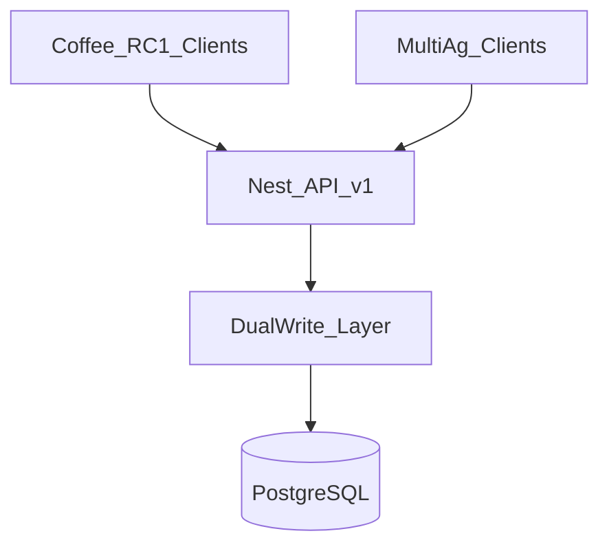

# 09 — Migration Strategy & Backward Compatibility

**Status:** Planning only  
**Date:** 2026-07-28  
**Parent:** [Platform Evolution index](./README.md)

---

## 1. Objectives

- Evolve schema and contracts **without** breaking RC1 coffee Buyer / Farmer / Courier / Admin flows.  
- Allow rollback of new category features via flags without rolling back money/delivery.  
- Keep a clear audit trail of listing attributes across dual-write.

---

## 2. Compatibility layers

| Layer | Responsibility |
|-------|----------------|
| API dual-write | Coffee columns ↔ attribute values |
| API dual-read | Prefer columns for coffee if present; else attributes |
| Feature flags | Category sell; attributes-v1 responses |
| App config | Default category COFFEE for Buna Gebeya |

---

## 3. Migration strategy (operational)

### Phase gate: RC1 freeze

Before any category activation:

- Revenue Engine migrations applied; `delivery.dynamic_fee.enabled = false`  
- Coffee create/checkout/pay/deliver smoke green  
- No production enablement of non-coffee sell  

### Data migration pattern

1. **Expand** — add tables/columns nullable.  
2. **Backfill** — batch job coffee → attributes.  
3. **Dual-write** — all new coffee writes hit both.  
4. **Soft switch** — readers prefer new shape behind flag.  
5. **Tighten** — nullable old constraints; new categories never use coffee cols.  
6. **Retire** — optional later drop/ignore legacy (RC2+).

Never skip to step 6 in the same release as step 2.

---

## 4. Backward compatibility plan

### Mobile RC1 builds

| Expectation | Guarantee |
|-------------|-----------|
| Coffee listing create body | Still accepted |
| `extensions.coffee` | Still returned |
| kg fields | Still dual-written for coffee |
| Checkout fees | Server `/pricing/active` |
| Absence of cereals | OK — inactive categories |

### Admin

| Expectation | Guarantee |
|-------------|-----------|
| Moderation of coffee listings | Continues with legacy fields visible |
| Pricing page | Unchanged |

### External / Express legacy

Gebaya root Express (`COMMISSION_RATE`) is **out of RC1 path**. Do not migrate it; quarantine or document Nest-only.

---

## 5. Rollback procedures

| Change type | Rollback |
|-------------|----------|
| Category sell flag | Turn flag off — listings already created remain |
| Attribute API | Disable `attributes-v1` capability; columns remain |
| Nullable coffee DDL | Cannot easily re-NOT NULL if nulls exist — **don’t activate non-coffee until nullable shipped and coffee still writing values** |
| Form schema | Pin mobile to embedded coffee pack fallback |

---

## 6. Testing gates per wave

| Wave | Must pass |
|------|-----------|
| G2 metadata | Coffee RC1 regression unchanged |
| G3 attributes | Coffee create dual-write; backfill count match |
| G3 nullable | Coffee create still succeeds; cereal create without coffee cols succeeds in staging only |
| G4 mobile | Coffee form parity; schema fetch failure falls back |
| G5 activate | Full produce path for illustrative cereals + coffee regression |

---

## 7. Communication

- Tag releases: `platform-evolution-g2`, `g3`, …  
- Update mobile RC1 checklists when behaviour changes.  
- Keep [Revenue Engine release notes](../releases/RC1-Revenue-Engine.md) gates intact during marketplace evolution.
