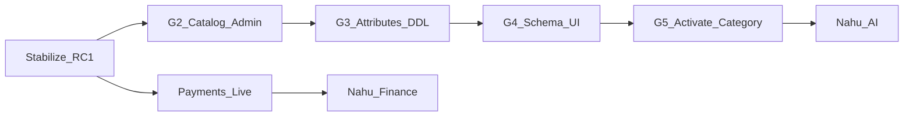

# 10 — Implementation Roadmap

**Status:** Planning only — no implementation in this pack  
**Date:** 2026-07-28  
**Parent:** [Platform Evolution index](./README.md)

---

## 1. Phase overview

| Phase | Goal | Ships code? | Activates non-coffee sell? |
|-------|------|-------------|----------------------------|
| **RC1 stabilize** | Coffee money + delivery solid | Hygiene/tests/docs only as needed | No |
| **G2** | Catalog admin + listing kind metadata | Yes | No |
| **G3** | Attribute tables + dual-write + nullable coffee cols | Yes | Staging experiments only |
| **G4** | Mobile/Admin schema-driven forms & facets | Yes | No (or closed beta) |
| **G5** | First non-coffee category E2E (illustrative: cereals) | Yes | Yes (flagged) |
| **Payments** | Live provider adapters | Separate program | Independent |
| **Finance** | Wallet/credit/insurance | Separate program | After payments |
| **AI** | Diagnosis/advisory products | Separate program | After data solid |

---

## 2. Phase details

### Phase 0 — Stabilize RC1 (current)

**Reuse:** Delivery RC1, Revenue Engine, coffee G1 contract.  
**Do:** Migrations/flags, checkout preview honesty, docs, junk cleanup ([technical debt](../technical-debt.md)).  
**Don’t:** Activate categories; enable dynamic delivery fees; live PSPs.

### Phase G2 — Catalog control plane

**Deliver:** Admin categories/products CRUD; `listing_kind`; sell checklist; feature flags per category.  
**Reuse:** Admin shell, catalog tables.  
**Risk:** Admins edit production catalog — use staging first + permissions.

### Phase G3 — Attributes foundation

**Deliver:** `attribute_definitions` / `listing_attribute_values`; coffee backfill; dual-write; soften NOT NULL.  
**Reuse:** Phase 3 design, G1 validation registry.  
**Risk:** Data drift — mandatory dual-write tests.

### Phase G4 — Experience engines

**Deliver:** `form-schema` / `facets` APIs; shared mobile renderer; Admin attribute panels.  
**Reuse:** Existing screens as hosts.  
**Risk:** UX regressions on coffee — parity checklist.

### Phase G5 — Activate illustrative vertical

**Deliver:** Cereals/Teff (illustrative) product seed, attrs, E2E sell/buy/deliver/pay(sim).  
**Reuse:** Entire platform spine.  
**Remain coffee-specific:** Buna Gebeya default skin.  
**Risk:** Support load — limit to one category; flag rollback.

### Platform modules (parallel tracks)

| Module | Depends on | Notes |
|--------|------------|-------|
| **Nahu Delivery expand** | Delivery RC1 | New goods types via metadata; same courier app |
| **Nahu Payments** | Revenue Engine intents | Telebirr/Chapa/CBE — [roadmap](../08-guides/revenue-engine-roadmap.md) |
| **Nahu Finance** | Payments + escrow history | Wallet, loans, BNPL |
| **Nahu AI** | Farm photos, listings, market data | Advisory packs; image grading |

---

## 3. Per-phase matrix (reuse / generalize / coffee / config)

| Phase | Reuse | Generalize | Coffee-specific | Configurable |
|-------|-------|------------|-----------------|--------------|
| G2 | Catalog DDL | Admin UX | Seeds remain coffee-primary | is_active, listing_kind |
| G3 | G1 extensions | Storage of attrs | Dual-write coffee cols | attribute_definitions |
| G4 | App shells | Forms/facets | Coffee pack = default schema | form-schema API |
| G5 | Orders/delivery/pricing | Sell path | Buna brand | Category flag |

---

## 4. Risk register (roadmap-level)

| Risk | Phase | Mitigation |
|------|-------|------------|
| Scope explosion (inputs+services+livestock at once) | G5 | One PRODUCE category first |
| Regulatory (vet, chemicals) | Later | Delay INPUT activation |
| Service scheduling complexity | Later | SERVICE kind after produce |
| Attribute model bikeshedding | G3 | Implement Phase 3 design as-is |
| Neglecting RC1 debt | All | Stabilisation gate before G2 |

---

## 5. Suggested success metrics

| Metric | Target |
|--------|--------|
| Coffee RC1 regression suite | Green every G-wave |
| Time to add a new PRODUCE product | Admin-only, no deploy (after G4) |
| Categories sellable | Coffee + ≥1 other (G5) |
| Hardcoded coffee fields in Farmer create | Zero (post G4) |

---

## 6. Non-goals until explicitly prioritised

- Multi-country / multi-currency marketplace  
- Full grocery SKU scale  
- Replacing Buna Gebeya store listing  
- Live payment rails (tracked separately)  
- Enabling `delivery.dynamic_fee` without routing/vehicle work  

---

## 7. Immediate next actions (after this pack is approved)

1. Keep RC1 public-test stabilisation on critical path.  
2. Schedule **G2 design spike** (Admin catalog UX wireframes + permissions).  
3. Do **not** open non-coffee sell flags.  
4. Treat this folder as authority for platform evolution discussions; refine via ADRs in `docs/07-decisions/` when a wave starts.
