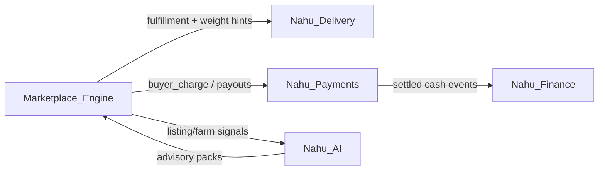

# 11 — Architecture Review Report

**Status:** Design review only — no production code  
**Date:** 2026-07-28  
**Scope:** Full review of [`docs/09-platform-evolution/`](./README.md) (01–10) against RC1 reality and long-term NAHU Platform goals  
**Audience:** Product + engineering leads  

---

## 1. Executive verdict

The Platform Evolution pack is **directionally sound** and correctly builds on G1, Phase 3, Delivery RC1, and the Revenue Engine. It will support **coffee today** and **multi-agriculture next** without a rewrite.

It is **not yet fully marketplace-agnostic** for arbitrary verticals (electronics, healthcare, wholesale construction). The documented core (catalog → listing → order → pricing → delivery) *can* scale there, but several **agriculture-shaped assumptions** remain in the domain language and listing core. Those must be named and softened **in design** before claiming a universal Marketplace Engine.

**Overall:** Approve the pack for **G2/G3 design-and-build**, contingent on the design deltas in [12 — Design Validation](./12-design-validation.md) and gates in [13 — Implementation Readiness](./13-implementation-readiness.md).

---

## 2. Domain validation

### 2.1 Remaining coffee-specific assumptions

| Assumption | Where in pack / codebase | Severity | Review note |
|------------|--------------------------|----------|-------------|
| Coffee enums NOT NULL on listings | Reality + doc 05 Wave C | **High (today)** | Pack correctly plans nullable + dual-write; must not slip |
| Certificates require grade/process | Doc 03/05 | High | Template model is right; coffee template must stay V1 |
| `extensions.coffee` as primary extension | G1 + docs 04/06 | Medium | Fine as first pack; registry must not special-case coffee forever |
| Buyer default category = COFFEE | Doc 07 | Low | Experience config — keep |
| Free-text `variety` vs catalog FK | Doc 03 | Medium | Migrate to `product_variety_id` |
| kg dual-write | Docs 05/09 | Medium | Coffee legacy; do not force on electronics later |
| Advisory ECX/coffee | Doc 02 | Low | Pluggable packs — OK |

**Finding:** The *strategy* isolates coffee well. The *current system* does not. Review accepts the isolation plan; implementation must treat coffee columns as transitional, not sacred.

### 2.2 Agriculture-only assumptions

| Assumption | Risk if reused for non-agri |
|------------|----------------------------|
| Brand/module **Nahu Farms** as the only marketplace umbrella | Non-agri verticals feel bolted on |
| Listing kinds named **PRODUCE / INPUT / SERVICE** | “Produce” is agri; furniture is not “produce” |
| Optional but culturally central `farm_id`, `harvest_date`, `woreda` | Electronics sellers have no farm/harvest |
| Stock lot / cropping cycle as primary supply path | Retail/wholesale use different inventory |
| Certificate = “origin / quality of agri goods” | Serial numbers / warranty certificates differ |
| Seller role mental model = **Farmer** | Need generic **Seller** actor (farmer is a seller type) |
| Category taxonomy seeded as agri sectors only | Need **marketplace vertical** or sector above category |

**Finding:** Domain is **agri-marketplace-first**, not **universal marketplace**. That is acceptable for the next 2–3 phases if we introduce a thin **Marketplace Vertical** (or `sector_code`) concept in design so Categories hang under `AGRI`, later `HOME`, `HEALTH`, etc., without renaming every table.

### 2.3 Is the domain truly marketplace-agnostic?

| Layer | Agnostic? | Comment |
|-------|-----------|---------|
| Identity / RBAC | Yes | |
| Orders / escrow | Yes | |
| Revenue Engine | Yes | Needs future tax/vertical dimensions |
| Delivery | Mostly yes | Weight/vehicle; hazmat/pharmacy later as policies |
| Catalog Category→Product→Variety | Yes if Category is not agri-bound | |
| Listing core | **Mostly** | Soften agri field semantics (`offerDate` not only harvest) |
| Listing kinds | **Partially** | Rename/generalize to Goods / Supplies / Services (or keep PRODUCE as agri alias) |
| Farms / harvest | Agri module | Correctly **separate** from marketplace core |
| Certificates | Template-driven → yes | |
| Mobile Farmer app | Agri experience | Seller app can host multiple seller profiles later |

**Verdict:** Core commerce spine is marketplace-capable. Pack language still reads as “generalize coffee into farms.” Elevate the **Marketplace Engine** explicitly (see §5).

### 2.4 Simplification opportunities

1. **One attribute system** — avoid long-term parallel `extensions.*` JSON *and* EAV without a sunset date for extensions as write-path.  
2. **Listing kind vocabulary** — map PRODUCE→`GOODS`, INPUT→`SUPPLIES` (or `MERCHANDISE`), SERVICE unchanged; keep agri aliases in config.  
3. **`harvest_date` → `offer_date` / `produced_on`** (nullable semantics) — one field, category labels.  
4. **Seller ≠ Farmer** — document FarmerProfile as a seller specialization; don’t put `farmerId` forever as the only seller FK on orders (today OK; design a `sellerPartyId` alias).  
5. **Don’t invent Commodity entity** — pack already correct; stick to Category/Product.  
6. **Defer SERVICE scheduling** — pack is right; don’t design calendars into G3.

---

## 3. Extensibility review

### 3.1 Within agriculture (should be easy)

| Vertical | Fit | How |
|----------|-----|-----|
| **Honey** | Excellent | Category + moisture/purity attrs; jar units; origin cert template |
| **Livestock** | Good | Attribute pack (species, sex, age, weight); logistics metadata; welfare flags |
| **Farm machinery** | Good | INPUT/SUPPLIES kind; brand/model/condition attrs; optional serial |
| **Ag services** | Good (MVP) | SERVICE kind; escrow without shipment or light “site visit” |

**Effort:** Mostly seed data + attribute packs + form/facet config after G3/G4 — **no platform redesign**.

### 3.2 Beyond agriculture (possible without redesign?)

| Vertical | Fit with current pack | Gaps to close in design (not code yet) |
|----------|----------------------|----------------------------------------|
| Construction materials | High | Category under new vertical; density/weight for delivery |
| Furniture | High | Dimensions/volume attrs; delivery volume already in tariffs |
| Electronics | Medium–High | Serial/warranty cert templates; return windows; no farm FK |
| Wholesale | Medium | MOQ attrs; B2B buyer org already partly in identity |
| Healthcare supplies | Medium | Regulatory flags; cold-chain shipment policies; compliance |

**Verdict:** Same architecture **can** support these **if**:

1. Categories are not hard-wired to agri taxonomy.  
2. `farm_id` / harvest remain optional.  
3. Seller model generalizes.  
4. Certificate + delivery **policies** are config packs.  
5. A **marketplace vertical** (tenant or sector) scopes branding, default apps, and compliance.

Without (1)–(5), non-agri launches will fork apps or pollute “Nahu Farms” semantics.

---

## 4. Configurability review

| Concern | Configurable today? | In evolution pack? | Gap |
|---------|---------------------|--------------------|-----|
| Categories | Partial (`is_active`) | Yes — Admin G2 | Need sell flags + vertical |
| Product types | Seeds / SQL | Yes — Admin CRUD | |
| Attributes | Coffee columns hard | Yes — G3 | |
| Units | Catalog units | Yes | Enforce dimension rules in validation packs |
| Quality grades | Coffee enum | Yes — vocabularies | |
| Pricing rules | Revenue Engine DB | Yes | Vertical-specific fee schedules later |
| Delivery rules | Tariffs + flags | Partial | Policy packs (cold chain, max weight) |
| Commissions | Delivery + platform fees | Yes | |
| Taxes | **No** | Mentioned future only | **Design tax lines before Finance** |
| Payments | Stub intents | Roadmap | Provider config, not hard-code |
| Facets / forms | Hard-coded mobile | Yes — G4 | |
| Certificate fields | Hard coffee | Templates | |
| Listing kind | Missing | Planned | Generalize names |
| Refund policies | Manual | Revenue roadmap | Policy engine |

**Must become configuration-driven before claiming platform maturity:** attributes, forms, facets, category activation, certificate templates, delivery policy packs, tax rules (design), payment provider routing.

---

## 5. Technical review

### 5.1 Database scalability

| Strength | Risk | Improvement |
|----------|------|-------------|
| SQL-first migrations | EAV growth | Typed defs + indexes; archive strategy |
| Dual-write path | Drift | Single writer module + reconciliation job |
| Soft FKs on fee_schedule/quote | Orphans | Add FKs when touching orders |
| Coffee enums in PG | Lock-in | Stop using for new categories; leave enums |

### 5.2 API evolution

| Strength | Risk | Improvement |
|----------|------|-------------|
| Additive v1 doctrine | Extension + attributes duplication | Publish one canonical read model |
| Form-schema / facets endpoints | Chatty mobile | Cache + schema version headers |
| Category-keyed validation | Pack registry sprawl | Code-generated packs from attribute defs |

### 5.3 Mobile scalability

| Strength | Risk | Improvement |
|----------|------|-------------|
| One app per role | Farmer app = only seller UX | Seller shell / multi-profile later |
| Shared marketplace helpers | Schema renderer not specified enough | Spike form-schema JSON contract in design |
| Coffee skin | Accidental coffee-only widgets | Lint/checklist: no new coffee-required UI |

### 5.4 Admin scalability

| Strength | Risk | Improvement |
|----------|------|-------------|
| Pricing / delivery ops exist | Catalog still SQL-operated | G2 is correctly first build wave |
| Moderation workflow generic | Coffee detail UI | Attribute panels |

### 5.5 Performance / security / maintainability / testability

| Area | Assessment |
|------|------------|
| Performance | Attribute filters need indexed strategies; avoid unbounded JSON queries |
| Security | Category regulatory flags; Admin catalog.write separation; PII in delivery unchanged |
| Maintainability | Pack is modular; risk is dual systems (columns vs attrs) lasting forever — set sunset criteria |
| Testability | Today: mirrored rules tests (debt). Require imported rules + category matrix tests from G3 |

---

## 6. Marketplace Engine review

### 6.1 Are we building a reusable engine?

**Yes, if we name and protect the core.** The pack implies it; it should state it explicitly:

```text
Marketplace Engine (platform)
  Catalog
  Listing + Attributes + Moderation
  Order + Escrow
  Pricing / Fee snapshots
  Certificates (templated)
  Search / Facets

Experience packs (apps / brands)
  Nahu Buna Gebeya (coffee)
  Nahu Farms (multi-ag)
  Future vertical apps or modes

Capability modules
  Delivery | Payments | Finance | AI
```

### 6.2 Reusable core components (keep stable)

1. Identity & permissions  
2. Catalog spine  
3. Listing core + attribute engine  
4. Order / escrow state machine  
5. Revenue Engine (fees, quotes, intents)  
6. Delivery aggregate (shipment, POD, earnings)  
7. Admin ops patterns (reauth, audit, queues)  
8. Moderation case model  

### 6.3 Experience / vertical packs (replaceable)

- Coffee extension + Buna Gebeya UI  
- Cereals / honey / livestock attribute packs  
- Farms ops (cropping, harvest) — **agri capability**, not required for all marketplaces  
- Future “Home goods” pack  

**Finding:** Farms module must remain **optional dependency** of listings (`farm_id` null-ok), or non-agri marketplaces inherit false coupling.

---

## 7. Platform modules integration



| Module | Coupling today | Target | Review |
|--------|----------------|--------|--------|
| **Delivery** | Order → fulfillment → shipment | Keep; policy packs for special goods | Good — already modular |
| **Payments** | Stub intents on order events | Adapters behind PaymentRails | Good — don’t leak providers into listings |
| **Finance** | None | Subscribe to payment + escrow events; credit scoring uses seller history | Design event contracts early |
| **AI** | Advisory coffee-ish | Read models only; write via advisory packs / listing suggestions | No AI columns on orders |

**Loose coupling rules (approve):**

1. Modules communicate via **order/shipment/payment IDs + events**, not by importing coffee types.  
2. Delivery never requires `process_method`.  
3. Finance never requires `farm_id`.  
4. AI never blocks checkout.  

---

## 8. Findings summary

| ID | Finding | Priority |
|----|---------|----------|
| F1 | Coffee DDL still hard; pack plan OK | P0 for G3 |
| F2 | Agri naming (Farms, PRODUCE, harvest, farmer) limits universal marketplace claim | P1 design delta |
| F3 | Missing marketplace vertical / sector above category | P1 design |
| F4 | Tax model undesigned | P1 before Finance |
| F5 | Seller = Farmer assumption | P1 design |
| F6 | Dual extension + EAV without sunset | P1 |
| F7 | Form-schema contract underspecified | P1 before G4 |
| F8 | Delivery/Payments/AI modularity is sound | Keep |
| F9 | Engine core is reusable if Farms stays optional | Keep + document |
| F10 | RC1 stabilize before G2 build | P0 |

---

## 9. Recommendation

**Conditional pass.** Proceed to implementation **only** of G2 (and design spikes for F2–F7), after RC1 stabilisation gates. Do **not** jump to G5 or non-agri verticals until design validation items in document 12 are accepted.

See [13 — Implementation Readiness](./13-implementation-readiness.md).
