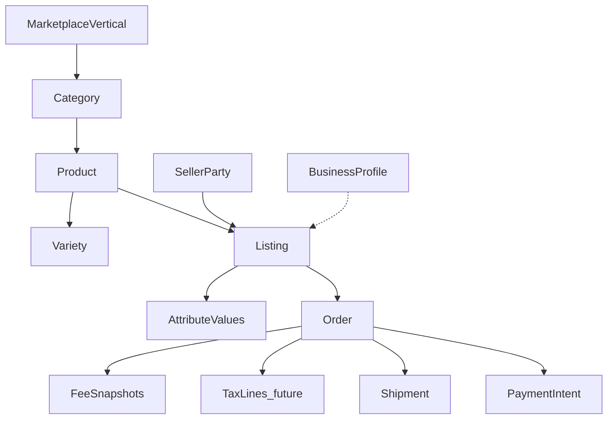

# 14 — Marketplace Engine Design

**Status:** Design locked — reusable engine architecture  
**Date:** 2026-07-28  
**Parent:** [Platform Evolution index](./README.md)  
**Inputs:** Docs [01–13](./README.md), deltas [15–21](./15-d1-marketplace-vertical.md)  
**Constraint:** Design only — no production code in this phase

---

## 1. Purpose

Define the **reusable Marketplace Engine** that powers:

- Coffee (RC1 / Nahu Buna Gebeya)  
- Multi-agriculture (Nahu Farms)  
- Future non-agricultural verticals  
- Integration with Delivery, Payments, Finance, and AI  

…without redesigning the platform for each sector.

---

## 2. Architecture layers

```text
┌─────────────────────────────────────────────────────────────┐
│ Experience packs (apps / brands)                            │
│  Buna Gebeya · Nahu Farms · future Construction / Retail …│
└────────────────────────────┬────────────────────────────────┘
                             │ configures
┌────────────────────────────▼────────────────────────────────┐
│ Configurable metadata                                       │
│  Verticals · Categories · Attributes · Form schemas         │
│  Enum sets · Fee schedules · Compliance profiles            │
└────────────────────────────┬────────────────────────────────┘
                             │ drives
┌────────────────────────────▼────────────────────────────────┐
│ Marketplace Engine (platform core)                          │
│  Catalog · Listings · Moderation · Orders/Escrow · Pricing  │
└────────────────────────────┬────────────────────────────────┘
                             │ events / IDs
┌────────────────────────────▼────────────────────────────────┐
│ Reusable adjacent services                                  │
│  Identity · Organizations · Delivery · Payments             │
│  Finance · Compliance · Notifications · AI                  │
│  Farms capability (optional, agri-only)                     │
└─────────────────────────────────────────────────────────────┘
```

| Layer | What belongs here | What does not |
|-------|-------------------|---------------|
| **Platform core** | Neutral commerce spine | Coffee columns as forever schema; Farmer-only actors |
| **Vertical extensions** | Agri packs, coffee pack, future sector packs | Forked order state machines |
| **Configurable metadata** | Verticals, attrs, forms, fees, restrictions | Hard-coded mobile screens (end state) |
| **Reusable services** | Delivery, Payments, Identity, … | Category-specific business rules inside them |

---

## 3. Platform core (stable)

### 3.1 Catalog

- **Marketplace Vertical** → Category → Product → Variety  
- Units allow-lists  
- Attribute definitions & enum sets  
- Form schemas (`nahu.form.v1`)

See [15 — Vertical](./15-d1-marketplace-vertical.md), [18 — Attributes](./18-d4-attribute-extension-strategy.md), [19 — Forms](./19-d5-form-schema-specification.md).

### 3.2 Marketplace (offers)

- Listing core (qty, unit, price, geo, media, status, kind)  
- Seller Party ownership  
- Optional Business Profile link  
- Moderation cases  
- Certificate instances from templates  
- Search / facets from config  

Kinds: `GOODS` | `SUPPLIES` | `SERVICE` ([17 — Terminology](./17-d3-terminology-guide.md)).

### 3.3 Orders & escrow

- Order aggregate, line snapshots, escrow transitions  
- Category-agnostic  

### 3.4 Pricing (Revenue Engine)

- Versioned fee & delivery tariff schedules  
- Quote + immutable snapshots  
- Future: consume Compliance tax assessments without owning tax law  

### 3.5 Identity & Organizations (shared platform)

- Authn/z, users, roles  
- Orgs for companies/coops; Seller Party may link to org ([16 — Seller Party](./16-d2-seller-party.md))

---

## 4. Vertical-specific extensions

| Extension | Scope | Mechanism |
|-----------|-------|-----------|
| Coffee pack | Category COFFEE | Attributes + form schema + cert template + dual-write columns (transitional) |
| Cereals / honey / livestock packs | Agri categories | Attributes + forms + facets only |
| Farms capability | Agriculture vertical | Optional farm/cropping/stock; **never required for checkout** |
| Farmer App | Seller UX for agri | Experience over SellerParty type `FARMER` |
| Future Construction pack | Vertical CONSTRUCTION | New metadata + seller types — same engine |

**Rule:** Extensions configure and decorate; they do not replace Orders, Pricing, or Delivery kernels.

---

## 5. Configurable metadata (summary)

| Metadata | Configured where | Used by |
|----------|------------------|---------|
| Verticals | Catalog Admin / seed | Category scope, branding, compliance profile |
| Categories / products / varieties | Catalog Admin (G2) | Listings, search |
| Listing kind | Category (or product) | Forms, fulfillment hints |
| Attributes & enums | Catalog (G3) | Validation, search, certificates |
| Form schemas | Catalog (G4 publish) | Seller/Buyer/Admin UIs |
| Fee & delivery schedules | Pricing Admin | Checkout |
| Tax & restriction rules | Compliance (future) | Quote, publish, checkout |
| App defaults | Remote config / env | Default vertical/category |

---

## 6. Reusable adjacent services

| Service | Integration contract |
|---------|----------------------|
| **Delivery** | Fulfillment from order; weight/volume/location; no coffee fields ([21](./21-d7-platform-module-boundaries.md)) |
| **Payments** | Intents on order totals; provider adapters; accounting-first today |
| **Finance** | Consumes payment/escrow events; credit uses seller history |
| **Compliance** | Tax lines + restriction evaluations ([20](./20-d6-tax-regulatory-model.md)) |
| **AI** | Advisory/read models; never authoritative on money or blocks without Compliance |
| **Notifications** | Templates keyed by event, not by coffee |
| **Farms** | Optional enrichment of agri listings |

---

## 7. Domain diagram (engine)



---

## 8. Invariants (engine constitution)

1. Categories belong to exactly one **Vertical**.  
2. Commerce actors on the sell side are **Seller Parties**; Farmer is a type.  
3. Listing core stays category-agnostic; specifics live in **attributes**.  
4. **Farms / Business Profile** optional for publish and checkout.  
5. Money path uses **snapshots** (fees today; taxes later).  
6. Experience packs may relabel UI; APIs use **neutral vocabulary** ([17](./17-d3-terminology-guide.md)).  
7. Modules couple via **IDs and events**, not vertical types ([21](./21-d7-platform-module-boundaries.md)).  
8. Coffee physical columns and `extensions.coffee` are **transitional**, not the long-term model ([18](./18-d4-attribute-extension-strategy.md)).

---

## 9. Mapping to implementation waves

| Wave | Engine impact |
|------|---------------|
| **G2** | Vertical + category Admin, sell flags — first concrete engine milestone |
| **G3** | Attributes + dual-write; listing kind; seller API aliases as touched |
| **G4** | Form-schema renderer |
| **G5** | Remove coffee-only write paths |
| Later | SellerParty table backfill, Compliance tax enablement, non-agri vertical pilot |

---

## 10. Final readiness assessment

### 10.1 Are D1–D7 resolved?

| Delta | Doc | Status |
|-------|-----|--------|
| D1 Marketplace Vertical | [15](./15-d1-marketplace-vertical.md) | **Resolved** |
| D2 Seller Party | [16](./16-d2-seller-party.md) | **Resolved** |
| D3 Neutral vocabulary | [17](./17-d3-terminology-guide.md) | **Resolved** |
| D4 Attribute & extension strategy | [18](./18-d4-attribute-extension-strategy.md) | **Resolved** |
| D5 Form schema specification | [19](./19-d5-form-schema-specification.md) | **Resolved** (implement in G4) |
| D6 Tax & regulatory model | [20](./20-d6-tax-regulatory-model.md) | **Resolved** (architecture only) |
| D7 Module boundaries + farms optional | [21](./21-d7-platform-module-boundaries.md) | **Resolved** |

### 10.2 Recommendation

**Yes — the Marketplace Engine architecture is sufficiently stable to begin G2 implementation.**

Remaining work is **execution and later-wave design detail**, not open questions that would invalidate Catalog Admin work.

### 10.3 First implementation milestone

**G2 — Admin Catalog Foundation**

1. Seed / expose **Marketplace Verticals**; attach categories to `AGRICULTURE`.  
2. Admin CRUD (or managed edit) for categories, products, varieties.  
3. `sell_enabled` / activation flags without coffee schema breakage.  
4. API responses include `verticalCode`.  
5. Obey terminology and module boundaries in all *new* Admin copy and routes.  

**Out of scope for this milestone:** attribute EAV tables (G3), form renderer (G4), SellerParty physical table (can follow), tax engine, non-agri vertical activation, Payments go-live.

### 10.4 Still not “engine complete”

Do not claim multi-vertical production readiness until: one non-coffee agri category sell-through, attributes live, form schema published, and SellerParty bridge underway — per [13](./13-implementation-readiness.md). Architecture stability for **starting G2** is separate from **engine completeness**.

### 10.5 Operational prerequisite

RC1 staging smoke (order fees + shipment) remains a **release gate** before merging G2 to staging — unchanged from the architecture review.
