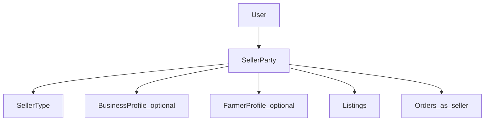

# 16 — D2: Seller Party

**Status:** Design locked — no production code  
**Resolves:** [12 — Design Validation](./12-design-validation.md) § D2  
**Parent:** [Platform Evolution index](./README.md)  
**Consumed by:** [14 — Marketplace Engine](./14-marketplace-engine-design.md)

---

## 1. Decision

Platform core commerce refers to a **Seller Party**, not a Farmer.

| Layer | Concept |
|-------|---------|
| **Core** | `SellerParty` — who offers listings and receives escrow/payouts |
| **Specialization** | Seller type + profile (Farmer, Company, Merchant, …) |
| **Experience** | Farmer App = agriculture seller UX over SellerParty |

The Farmer App remains. The API/domain must stop treating “farmer” as the only seller kind forever.

---

## 2. Seller types (initial vocabulary)

| Code | Name | Typical vertical |
|------|------|------------------|
| `FARMER` | Farmer | Agriculture |
| `COMPANY` | Company | Any |
| `MERCHANT` | Merchant | Retail / agri trade |
| `MANUFACTURER` | Manufacturer | Manufacturing / inputs |
| `COOPERATIVE` | Cooperative | Agriculture |
| `DISTRIBUTOR` | Distributor | Wholesale |
| `INDIVIDUAL` | Individual Seller | Retail / services |

Types are **configuration** (seed table), not hard-coded enums in every service. Apps may filter allowed types by vertical metadata (D1).

---

## 3. Conceptual model

```text
User (identity)
  └── SellerParty (1..n over time; MVP often 1)
        ├── seller_type_code
        ├── display_name / legal_name
        ├── organization_id? (D7 Organizations)
        ├── business_profile_id? (neutral “farm/shop/site”)
        └── specializations
              ├── FarmerProfile (agri)     → existing farmer_* tables
              ├── CompanyProfile (future)
              └── …
```



---

## 4. Data model (target, additive)

### 4.1 Core

```text
marketplace.seller_parties
  id                UUID PK
  owner_user_id     UUID NOT NULL FK → identity.users
  seller_type_code  VARCHAR NOT NULL
  display_name      VARCHAR NOT NULL
  legal_name        VARCHAR NULL
  organization_id   UUID NULL
  business_profile_id UUID NULL
  status            VARCHAR NOT NULL  -- ACTIVE | SUSPENDED | …
  metadata          JSONB DEFAULT '{}'
  created_at / updated_at

marketplace.seller_types
  code, name_en, name_am, is_active, sort_order
```

### 4.2 Compatibility bridge (RC1)

Today listings/orders use `farmer_id` (or equivalent). Migration path:

```text
1. Create seller_parties
2. Backfill one SellerParty per existing farmer (type=FARMER)
3. Add listings.seller_party_id / orders.seller_party_id NULL
4. Dual-write farmer_id + seller_party_id
5. Readers prefer seller_party_id; farmer_id remains until G5-class cleanup
```

**Do not** rename `farmer_id` columns in G2. Alias in API first:

```json
{
  "sellerPartyId": "…",
  "sellerType": "FARMER",
  "farmerId": "…" 
}
```

---

## 5. Business Profile vs Farm

| Legacy | Neutral core | Agri experience |
|--------|--------------|-----------------|
| Farm | **Business Profile** (optional production/trade site) | Farm is a Business Profile subtype / linked farm ops entity |
| `farm_id` on listing | Optional `business_profile_id` | Farmer App still shows “Farm” |

Farms module (cropping, harvest) stays an **Agriculture capability**. Checkout must not require a farm (D7 / original farms-optional invariant).

---

## 6. Admin & API

| Surface | Behavior |
|---------|----------|
| Admin | Search sellers by party; filter by type; link to user/org |
| `GET /sellers/me` | Returns SellerParty (+ FarmerProfile if present) |
| Listing create | Authorize via SellerParty ownership |
| Payouts (future) | Settle to SellerParty bank/payout methods |

Farmer App login continues to resolve User → FarmerProfile → SellerParty (created implicitly if missing during backfill era).

---

## 7. Implementation waves

| Wave | Work |
|------|------|
| Design (now) | This doc — glossary + bridge |
| G2 | No mandatory seller_parties table; Admin Catalog only |
| G3 / parallel | Introduce `seller_parties` + backfill + API aliases when touching listing ownership |
| Later | Company/Merchant onboarding flows; org-linked parties |

**G2 may start without the physical `seller_parties` table**, provided domain docs and API design use SellerParty language and do not add new farmer-only constraints.

---

## 8. Invariants

1. Every listing has a seller party (physically `farmer_id` until bridged).  
2. Farmer is a seller type, not the marketplace actor noun in new docs/APIs.  
3. Buyer and Courier are not SellerParties.  
4. One user may eventually own multiple SellerParties; MVP assumes one active.
