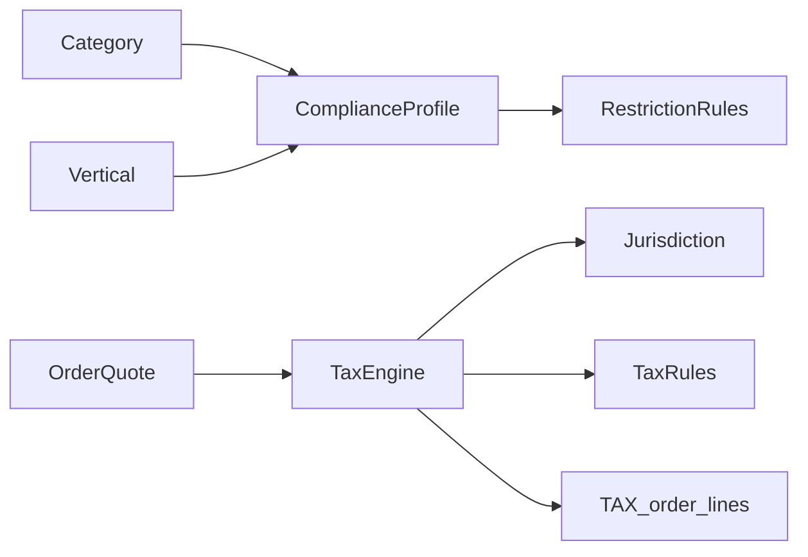

# 20 — D6: Tax & Regulatory Model

**Status:** Architecture only — no production code  
**Resolves:** [12 — Design Validation](./12-design-validation.md) § D6  
**Parent:** [Platform Evolution index](./README.md)  
**Consumed by:** [14 — Marketplace Engine](./14-marketplace-engine-design.md) · Payments / Finance roadmaps

---

## 1. Decision

Introduce a **Compliance layer** that is configuration-driven and vertical-aware. It must support future VAT, GST, sales tax, regional taxes, product restrictions, regulated goods, and country-specific rules **without** hard-coding rates into listing or coffee modules.

**No implementation in G2.** Design shapes order money and catalog flags so Payments/Finance do not force a rewrite.

---

## 2. Separation of concerns

| Concern | Owner | Notes |
|---------|-------|-------|
| Catalog restrictions | Compliance + Catalog | Who may sell/buy what |
| Tax calculation | Compliance + Pricing | Produces tax lines |
| Fee / commission | Revenue Engine (existing) | Not tax |
| Capture / remittance | Payments | Pays authorities or holds |
| Reporting | Finance | Filings, ledgers |

Tax is **not** a listing attribute. Restrictions may be *signaled* by category metadata + compliance rules.

---

## 3. Conceptual model

```text
Jurisdiction (country / region / city)
  └── TaxRegime (VAT | GST | SALES | …)
        └── TaxRule (rate, inclusive?, effective dates, product classes)

ComplianceProfile (on Vertical and/or Category)
  └── RestrictionRule (age, license, banned HS codes, cold-chain required, …)

Order snapshot
  └── Line types: GOODS | SELLER_FEE | BUYER_FEE | DELIVERY | TAX | …
```



---

## 4. Tax engine (future behavior)

**Inputs:** buyer address jurisdiction, seller jurisdiction, category/product tax class, goods amount, fee lines, delivery amount, timestamps.  
**Outputs:** immutable **tax lines** on quote/order (code, rate, basis amount, tax amount, inclusive flag).

### 4.1 Order line types (extend Revenue Engine)

| Type | Purpose |
|------|---------|
| `GOODS` | Merchandise |
| `BUYER_FEE` / `SELLER_FEE` | Platform fees (existing concept) |
| `DELIVERY` | Delivery fee |
| `TAX` | Statutory tax |
| `DISCOUNT` | Future |

Tax lines are snapshotted like fees — **never recompute history** silently.

### 4.2 Rule configuration (not code)

```text
compliance.tax_rules
  jurisdiction_code, tax_type, rate_bps, price_inclusive,
  applies_to: GOODS | DELIVERY | FEES | …,
  product_tax_class?, category_id?, vertical_id?,
  effective_from, effective_to, is_active
```

Rates editable via Admin Compliance (future), same operational discipline as Pricing schedules.

---

## 5. Product restrictions & regulated goods

```text
compliance.restriction_rules
  code, severity: BLOCK | WARN | LICENSE_REQUIRED,
  scope: VERTICAL | CATEGORY | PRODUCT | ATTRIBUTE,
  condition_json, message_key, is_active
```

Examples:

- Category `PESTICIDE` → seller license required  
- Healthcare supplies → buyer org verification  
- Livestock movement → permit attribute required before ACTIVE  
- Tourism → seasonal ban window  

Evaluation at: listing publish, checkout start, payout (optional).

Category `regulatory_flags` / vertical `compliance_profile_code` (D1) point at profiles that bundle rules.

---

## 6. Country-specific compliance

| Dimension | Approach |
|-----------|----------|
| Ethiopia VAT | First regime when Payments go-live planning starts |
| Multi-country | Jurisdiction tree; orders carry `tax_jurisdiction_code` |
| Invoicing | Finance owns legal invoice artifacts; Marketplace stores IDs only |
| Withholding | Separate rule type on seller payouts (Finance + Payments) |

---

## 7. API / module boundaries

```text
POST /pricing/quote  (or checkout preview)
  → includes taxLines[] when tax engine enabled (feature flag)

Compliance module
  - does not own cart UX
  - does not own payment capture
  - publishes TaxAssessment DTO to Orders / Payments
```

Feature flag: `compliance.tax.enabled` default **false** until configured (same spirit as dynamic delivery fee gate).

---

## 8. Relationship to G2

G2 Catalog may add optional `tax_class` / `regulatory_flags` on category **as nullable metadata** without enabling tax calculation.

**Do not** implement tax math in G2.

---

## 9. Invariants

1. Fees ≠ taxes.  
2. Tax amounts on settled orders are immutable snapshots.  
3. No coffee-specific tax columns.  
4. Restrictions fail closed for `BLOCK` severity.  
5. AI must not override compliance blocks.
