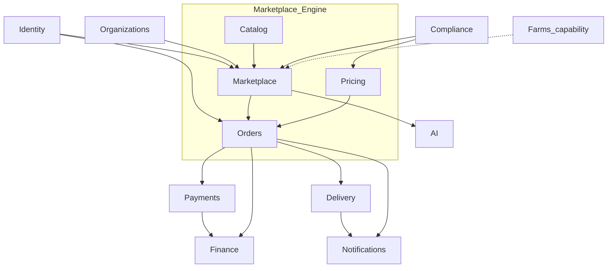

# 21 — D7: Platform Module Boundaries

**Status:** Design locked — no production code  
**Resolves:** [12 — Design Validation](./12-design-validation.md) § D7 (expanded: farms-optional + full module ownership)  
**Parent:** [Platform Evolution index](./README.md)  
**Consumed by:** [14 — Marketplace Engine](./14-marketplace-engine-design.md)

---

## 1. Decision

NAHU is a **modular platform**. Each module owns a bounded context, publishes stable IDs/events, and must not import vertical-specific types (coffee grade, farm harvest) into shared kernels.

**Farms / Business Profiles are optional** for listings and checkout. Agriculture capabilities never gate non-agri commerce.

---

## 2. Module ownership map

| Module | Owns | Does not own |
|--------|------|--------------|
| **Identity** | Users, authn/authz, sessions, roles, permissions | Seller business data, listings |
| **Organizations** | Companies, coops, membership, org KYC links | Listings, orders |
| **Catalog** | Verticals, categories, products, varieties, attributes, form schemas, units | Orders, fees, shipments |
| **Marketplace** | Listings, moderation cases, certificates (templates/instances), search indexes for offers | Payment capture, courier routing |
| **Orders** | Cart/checkout, order aggregate, escrow state machine, order lines snapshot | Tax rule admin (Compliance), delivery assignment |
| **Pricing** | Fee schedules, delivery tariffs, quote APIs, revenue snapshots | Statutory tax regimes (uses Compliance assessment) |
| **Payments** | Payment intents, provider adapters, capture/refund rails | Fee policy, escrow business rules |
| **Delivery** | Shipments, stops, POD, courier earnings, tracking | Listing quality attrs, tax |
| **Finance** | Ledgers, wallets, credit, insurance products, filings | Checkout UX |
| **AI** | Models, advisory packs, inference jobs | Authoritative price/tax/compliance decisions |
| **Notifications** | Templates, delivery channels, preferences | Business decisions |
| **Compliance** | Tax rules, restriction rules, profiles (D6) | Order UX |
| **Farms (capability)** | Farms, cropping, harvest, stock lots (agri) | Generic checkout |

**Marketplace Engine** = Catalog + Marketplace + Orders + Pricing (+ Identity/Org as shared platform services). Delivery, Payments, Finance, AI, Compliance, Farms, Notifications are **adjacent modules**.

---

## 3. Coupling rules

| From → To | Allowed dependency | Forbidden |
|-----------|-------------------|-----------|
| Orders → Catalog | Read product/category/vertical | Mutate catalog |
| Orders → Pricing | Request quote | Embed fee rates |
| Orders → Delivery | Create fulfillment intent | Courier matching logic inside Orders |
| Marketplace → Farms | Optional FK | Require farm for ACTIVE listing globally |
| Delivery → Marketplace | Read weight/volume/location hints | Require process_method |
| Payments → Orders | Intent by order id | Coffee enums |
| Finance → Payments/Orders | Event consumers | Direct UI coupling |
| AI → Marketplace | Suggest attrs / advisory | Block checkout or override escrow |

**Communication style:** prefer IDs + domain events (`OrderPlaced`, `ShipmentDelivered`, `PaymentCaptured`) over cross-DB joins in app code.

---

## 4. Farms-optional invariant (original D7)

1. `farm_id` / business profile on listing is **nullable**.  
2. Checkout and escrow **must not** call Farms APIs.  
3. Stock-lot linkage is an agri optimization, not a platform prerequisite.  
4. Non-`AGRICULTURE` verticals never depend on Farms module deployment.

---

## 5. Experience packs vs modules

| Pack | Modules it configures | Must not fork |
|------|----------------------|---------------|
| Nahu Buna Gebeya | Catalog (coffee), form schemas, default filters | Orders, Pricing, Delivery kernels |
| Nahu Farms | Agriculture vertical, Farmer App, Farms capability | Payments core |
| Future Construction app | Construction vertical + seller types | New escrow engine |

---

## 6. Shared kernel (minimal)

Keep tiny and stable:

- Money (currency, minor units)  
- Geo point / address snapshot  
- Unit codes  
- Audit actor  
- Error envelope  

Vertical packs and attribute systems live **outside** this kernel.

---

## 7. Test ownership

| Module | Required tests |
|--------|----------------|
| Pricing | Schedule math, snapshots |
| Orders | Escrow transitions, line immutability |
| Delivery | Status machine, POD |
| Catalog | Attribute validation matrix |
| Compliance | Restriction + tax assessment (when built) |

No mirrored copy-paste of pricing rules into mobile — import shared contracts where the monorepo allows.

---

## 8. G2 implications

G2 touches **Catalog** (+ Admin) primarily. It must:

- Introduce/respect **Vertical** ownership of categories  
- Avoid new Orders/Delivery/Payments coupling  
- Not require Farms for category activation  
- Leave Compliance flags optional metadata only
